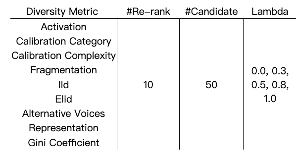
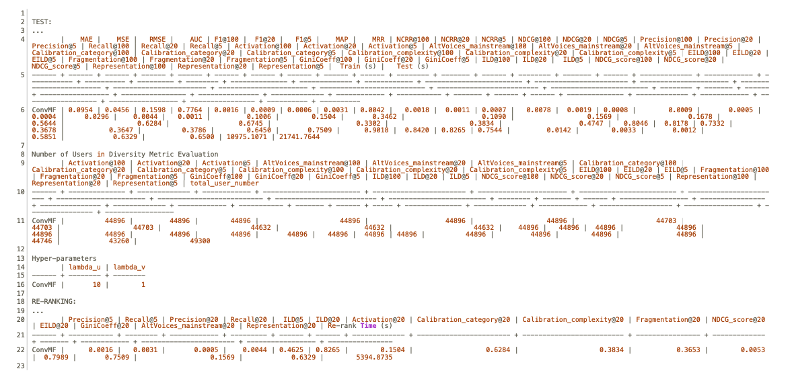

### Dataset Description

In the benchmark experiments, we use the _MIND_ validation dataset from [Microsoft News Dataset](https://msnews.github.io/). There are a total of 50k users and 4 million interactions. In order to speed up the benchmark process, we randomly selected 20k users. Thus, we ended up with 20k users, 28k items, and 1.4 million interactions, we name it **MIND-Benchmark**. The dataset description is shown below.

| Dataset | #Total Users | #Total Items |Type | #Training Users | #Training Items | #Training Ratings | #Test Users | #Test Items | #Test Ratings |
| :----: | :----: | :----: | :----:| :----:| :----: |:----: |:----: |:----: |:----: |
| MIND | 20,000 | 28,307 | INT<br> [1,5] | 20,000 | 28,307 | 1,189,494 | 19,663 | 14,641 | 294,910 |

We experiment with 5 models, which include 2 existing algorithms in the Cornac framework, namely CTR and HFT, and three newly implemented diverse algorithms, namely ConvMF, DAE, and ENMF.

### Experiments
#### 1. Fine-Tuning Models
Based on previous experiments, we further fine-tune some hyperparamters on 5 models with the MIND-Benchmark dataset.

<table border="0" cellpadding="0" cellspacing="0" width="1296" style="border-collapse:
 collapse;table-layout:fixed;width:970pt">
 <colgroup><col class="xl65" width="87" style="width:65pt">
 <col class="xl65" width="127" style="mso-width-source:userset;mso-width-alt:4053;
 width:95pt">
 <col class="xl65" width="87" span="3" style="width:65pt">
 <col class="xl65" width="133" style="mso-width-source:userset;mso-width-alt:4266;
 width:100pt">
 <col class="xl65" width="87" span="4" style="width:65pt">
 <col class="xl65" width="121" style="mso-width-source:userset;mso-width-alt:3882;
 width:91pt">
 <col class="xl65" width="87" style="width:65pt">
 <col class="xl65" width="132" style="mso-width-source:userset;mso-width-alt:4224;
 width:99pt">
 </colgroup><tbody><tr height="21" style="height:16.0pt">
  <td height="21" class="xl65" width="87" style="height:16.0pt;width:65pt">Model</td>
  <td colspan="3" class="xl66" width="301" style="width:225pt">Hyperparameter</td>
  <td class="xl66" width="87" style="width:65pt">Model</td>
  <td class="xl66" width="133" style="width:100pt">Hyperparameter</td>
  <td class="xl66" width="87" style="width:65pt">Model</td>
  <td colspan="2" class="xl66" width="174" style="width:130pt">Hyperparameter</td>
  <td class="xl66" width="87" style="width:65pt">Model</td>
  <td class="xl66" width="121" style="width:91pt">Hyperparameter</td>
  <td class="xl66" width="87" style="width:65pt">Model</td>
  <td class="xl66" width="132" style="width:99pt">Hyperparameter</td>
 </tr>
 <tr height="21" style="height:16.0pt">
  <td rowspan="6" height="126" class="xl68" style="height:96.0pt">CTR</td>
  <td class="xl67" style="border-top:none">k</td>
  <td class="xl67" style="border-top:none">lambda u</td>
  <td class="xl67" style="border-top:none">lambda v</td>
  <td rowspan="6" class="xl70" style="border-top:none">HFT</td>
  <td class="xl67" style="border-top:none">k</td>
  <td rowspan="6" class="xl70" style="border-top:none">ConvMF</td>
  <td class="xl67" style="border-top:none">lambda u</td>
  <td class="xl67" style="border-top:none">lambda v</td>
  <td rowspan="6" class="xl70" style="border-top:none">DAE</td>
  <td class="xl67" style="border-top:none">k dimension</td>
  <td rowspan="6" class="xl70" style="border-top:none">ENMF</td>
  <td class="xl67" style="border-top:none">negative weight</td>
 </tr>
 <tr height="21" style="height:16.0pt">
  <td rowspan="5" height="105" class="xl65" style="height:80.0pt">400</td>
  <td class="xl65">1000</td>
  <td class="xl65">0.01</td>
  <td class="xl65">10</td>
  <td class="xl65">1000</td>
  <td class="xl65">0.01</td>
  <td class="xl65">20</td>
  <td class="xl65">0.1</td>
 </tr>
 <tr height="21" style="height:16.0pt">
  <td height="21" class="xl65" style="height:16.0pt">1000</td>
  <td class="xl65">10</td>
  <td class="xl65">100</td>
  <td class="xl65">1000</td>
  <td class="xl65">10</td>
  <td class="xl65">200</td>
  <td class="xl65">0.3</td>
 </tr>
 <tr height="21" style="height:16.0pt">
  <td height="21" class="xl65" style="height:16.0pt">1000</td>
  <td class="xl65">1000</td>
  <td class="xl65">200</td>
  <td class="xl65">1000</td>
  <td class="xl65">1000</td>
  <td class="xl65">600</td>
  <td class="xl65">0.5</td>
 </tr>
 <tr height="21" style="height:16.0pt">
  <td height="21" class="xl65" style="height:16.0pt">0.01</td>
  <td class="xl65">1000</td>
  <td class="xl65">300</td>
  <td class="xl65">0.01</td>
  <td class="xl65">1000</td>
  <td class="xl65">1000</td>
  <td class="xl65">0.8</td>
 </tr>
 <tr height="21" style="height:16.0pt">
  <td height="21" class="xl65" style="height:16.0pt">10</td>
  <td class="xl65">1000</td>
  <td class="xl65">400</td>
  <td class="xl65">10</td>
  <td class="xl65">1000</td>
  <td class="xl65">5000</td>
  <td class="xl65">1</td>
 </tr>
 <!--[if supportMisalignedColumns]-->
 <tr height="0" style="display:none">
  <td width="87" style="width:65pt"></td>
  <td width="127" style="width:95pt"></td>
  <td width="87" style="width:65pt"></td>
  <td width="87" style="width:65pt"></td>
  <td width="87" style="width:65pt"></td>
  <td width="133" style="width:100pt"></td>
  <td width="87" style="width:65pt"></td>
  <td width="87" style="width:65pt"></td>
  <td width="87" style="width:65pt"></td>
  <td width="87" style="width:65pt"></td>
  <td width="121" style="width:91pt"></td>
  <td width="87" style="width:65pt"></td>
  <td width="132" style="width:99pt"></td>
 </tr>
 <!--[endif]-->
</tbody></table>

#### 2. Diversity Benchmarks
There are a total of 10 diversity metrics that have been implemented and integrated into the Cornac framework. Therefore, we rerank top 10 diversed items selected from the first 50 recommended candidate items, to compare which diversity increases the most with this [re-ranking method](Re-rank-TOP-K-from-a-set-of-Candidates).

<div align=center>{:height="400px" width="500px"}</div>

Finally, we experiment with different lambda constant values: 0~1 (0.0, 0.3, 0.5, 0.8, 1.0), to observe how it influences the diversified recommendation results on specific diversity metric.

### Realization
We write a [script](https://gitlab.ifi.uzh.ch/ddis/Students/Projects/2023-diversity-framework/-/blob/merge_reranking/main.py?ref_type=heads) for conveniently running the benchmark experiments. Take CTR as an example:

        python main.py --model 'CTR' --CTR_lambda_u 1000 --CTR_lambda_v 10 --diversity_objective 'activation' --lambda_constant 0.5 --rerank 10 -k 50

The "model" is the model's name, followed by hyperparameters settings, and the "diversity objective" is the metric that will be improved by re-ranking methods, followed by related re-ranking parameters (e.g., select top 10 diversed items from 50 first items). The order doesn't matter. You can run ```python main.py --help``` to get what the parameters you can adjust. The result exampke is shown below, try free in the command, to start your experiment now!

```python
usage: main.py [-h] [--model MODEL] [--topk TOPK] [--rerank RERANK] [--k K]
               [--lambda_constant LAMBDA_CONSTANT] [--epochs EPOCHS] [--CTR_k CTR_K]
               [--CTR_lambda_v CTR_LAMBDA_V] [--CTR_lambda_u CTR_LAMBDA_U] [--HFT_k HFT_K]
               [--ConvMF_lambda_v CONVMF_LAMBDA_V] [--ConvMF_lambda_u CONVMF_LAMBDA_U]
               [--DAE_dims DAE_DIMS] [--ENMF_neg_weight ENMF_NEG_WEIGHT]
               [--diversity_objective DIVERSITY_OBJECTIVE]

Benchmarking for the Cornac Algorithms

optional arguments:
  -h, --help            show this help message and exit
  --model MODEL         the name of the recommender model
  --topk TOPK           the number of items in the top@k list
  --rerank RERANK       the top@k items recommended to be reranked
  --k K                 the candidate item list where the reranking items will be chosen from
  --lambda_constant LAMBDA_CONSTANT
                        weight factor of the diversity metrics
  --epochs EPOCHS       upper epoch limit
  --CTR_k CTR_K         The dimension of the latent factors in CTR model
  --CTR_lambda_v CTR_LAMBDA_V
                        The regularization parameter for items in CTR model
  --CTR_lambda_u CTR_LAMBDA_U
                        The regularization parameter for users in CTR model
  --HFT_k HFT_K         The dimension of the latent factors in HFT model
  --ConvMF_lambda_v CONVMF_LAMBDA_V
                        The regularization hyper-parameter for item latent factor in ConvMF model
  --ConvMF_lambda_u CONVMF_LAMBDA_U
                        The regularization hyper-parameter for user latent factor in ConvMF model
  --DAE_dims DAE_DIMS   The dimension of autoencoder layer in DAE model
  --ENMF_neg_weight ENMF_NEG_WEIGHT
                        Negative weight in ENMF model
  --diversity_objective DIVERSITY_OBJECTIVE
                        metric name for diversity objective
```

### Regarding Result Output Changes

In the original Cornac framework, results were stored in a "log" file as the output of running experiments. We have continued to utilize their code while implementing alterations to how the results are presented.    
**(1)Number of Users in Diversity Metric Evaluation**  
Please be aware that in the benchmark experiment, some items in the Mind news dataset lack complete features, such as complexity, story or political parties. It would impact the metric computation. For example, the Calibration metric relies on user history (history item IDs). It is possible that the system cannot find more than one complexity value in the user history for certain users. In such cases, the system lacks sufficient information to calculate the Calibration metric for these users. Considering our experiment calculates the average metric value across users, we exclude metric computation for these users to maintain an unbiased average result. To show the summary of users and the diversity results, our experiment result includes the user count for each diversity metric. Below is an example:
<p align="center">
  
</p>
<p align="center">
    <em> Figure. The output demo for a ConvMF model.
  </em>
</p>
At first glance, the varying number of users in diversity metric evaluation might seem perplexing. As mentioned earlier, these differences arise due to incomplete item features. Computation is skipped for users whose recommendations lack sufficient features or lack enough contextual information.  

**(2)Hyper-parameters**  
Additionally, we record hyperparameters for user reference. Users can modify the "parameters.ini" file to have their hyperparameters recorded. To record specific parameters, users must edit the "tune_parameters" line inside the file corresponding to the model being trained.   
It's important to note that while the "parameters.ini" file displays specific hyper-parameter values for some models, the file operates as a "demo" version and is not currently read by the system. This aspect remains a part of future work. 

**(3)RE-RANKING**   
Furthermore, the software records re-ranking results for reference and analysis.

