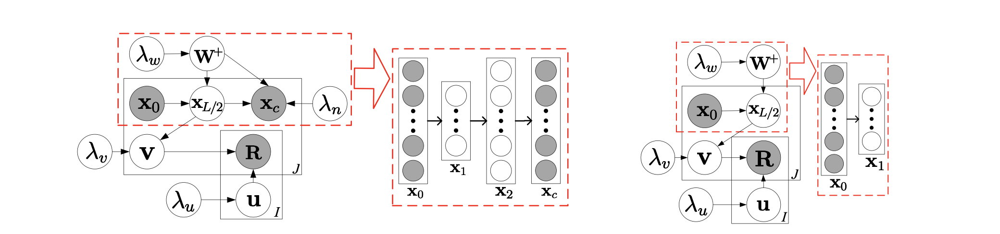
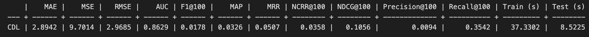
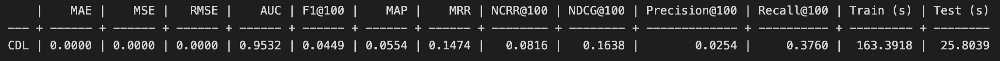
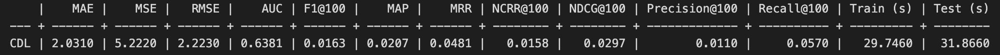
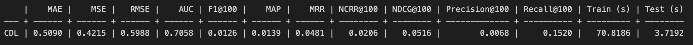

TODO:
- [ ] explain what is the goal of the experiment; write this before you describe the algorithm;
- [ ] mention the diversity metrics you use to evaluate the recommendations
- [ ] this point is still open each table should have a description; for each table and figure that you add, you need to mention which are your main findings/observations; see the Results section at the end of the page; there are many tables but very little description of those

# Introduction
## Collaborative Deep Learning (CDL) Model
Collaborative Deep Learning (CDL) [1] is a hierarchical Bayesian model that jointly performs deep representation learning for the content information and collaborative filtering for the ratings (feedback) matrix. Collaborative Deep Learning is developed based on the collaborative topic regression (CTR) [2] model to address the sparse auxiliary information problem.

TODO:
- [ ] what does SDAE mean? what is L?  

The above figure is an example of SDAE with L=2. The graphical model of CDL is on the left side of the image. The part inside the dashed rectangle represents an SDAE. The graphical model of the degenerated CDL is on the right is the image. The part inside the dashed rectangle represents the encoder of an SDAE.

## Dataset
The CDL model requires text modality data. Thus, we selected four datasets integrated into the Cornac framework and containing the text auxiliary information, and used an additional dataset, namely the MIND dataset. Below, we briefly introduce all the datasets we use in our experiments.

### Amazon clothing dataset and Amazon digital music dataset
The Amazon product dataset contains reviews (ratings, text, helpfulness votes), product metadata (descriptions, category information, price, brand, and image features), and links (also viewed/also bought graphs) from Amazon, including 142.8 million reviews spanning May 1996 - July 2014. 

From the large Amazon product dataset collection, we choose to use the clothing dataset and the digital music dataset.

We use item description as auxiliary text information for the clothing dataset and the review text as auxiliary text information for the digital music dataset.

### CiteULike dataset
The CiteULike dataset is used in the original paper that proposed the CDL algorithm. The dataset was collected from CiteULike and Google Scholar. CiteULike allows users to create their own collections of articles. Data include abstracts, titles, and tags for each article, and other information like authors, groups, posting time, and keywords. The CiteULike dataset includes 2 sub-datasets - CiteULike-a and CiteULike-t. For these experiments, we use the CiteULike-a from Cornac.

The text information we used includes tile and abstract joined together into one document per item.

### Movienlens 10k dataset
The data was collected through the MovieLens website (movielens.umn.edu) during a seven-month period from September 19th, 1997 through April 22nd, 1998. This dataset consists of 100,000 ratings (1-5) from 943 users on 1682 movies. Each user has rated at least 20 movies. The dataset also contains demographic information of the users, such as age, gender, occupation, zip code.

For this dataset, we used the plot information of movies from the built-in module of Cornac as text modality.

### MIND dataset
The MIND dataset is the additional dataset besides the built-in Cornac datasets. MIcrosoft News Dataset (MIND) is a large-scale dataset for news recommendation research. It was collected from anonymized behavior logs of the Microsoft News website. MIND contains about 160k English news articles and more than 15 million impression logs generated by 1 million users. Every news article contains rich textual content, including title, abstract, body, category, and entities. Each impression log contains the click events, non-clicked events, and historical news click behaviors of this user before this impression. 

We use the news content as the auxiliary text information.

# Experiment
## Setup
1. Prepare dataset: load data in (item id, user id, rating) format
2. Split dataset: normally, we use 20% of the dataset as the test set.
3. Initialize model: we have developed a [script](https://gitlab.ifi.uzh.ch/ddis/Students/Projects/2023-diversity-framework/-/blob/algorithm/cornac/algorithm/cdl/cdl_mind.ipynb) to automate parameters changes, model training and results logging. Basically, we changed parameters like k,v to find the best parameters for both accuracy and diversity.
4. Define metrics to evaluate the model: we used all the Cornac built-in metrics to evaluate the accuracy of the model. Besides, we evaluate the diversity of the recommended items on these [addition metrics](https://gitlab.ifi.uzh.ch/ddis/Students/Projects/2023-diversity-framework/-/wikis/home#diversity-metrics).
5. Perform the experiment using the Cornac built-in `Experiment` module.

## Run model on different datasets with various parameters

TODO:
- [ ] this short section with the goal should be moved at the beginning, so that people that open the page understand from the beginning what is the page describing;

### Goal
The goal of these experiments is to find out, for each dataset, the optimal parameters of the model that allows us to recommend accurate and diverse items. We run the CDL model on all available datasets, and evaluate its accuracy and diversity.

### Diversity metrics
To compute the calibration metric, we do not extra features extracted from the textual components of the items. To compute the fragmentation metric, however, we need to detect the stories in our data. We compute the [Calibration diversity metric](/ddis/Students/Projects/2023-diversity-framework/-/wikis/Calibration) and the [Fragmentation diversity metric](/ddis/Students/Projects/2023-diversity-framework/-/wikis/Fragmentation) for the MIND datasets, and calibration for the MovienLens dataset. The higher the value is, the more diverse the recommended items are.

TODO:
- [ ] in the paragraph above, you only mention MIND and MovieLens; What happens with the other datasets? 

The result of the experiment is shown in the table below. The first column is the name of the model, and the second column refers to the dataset. k, max_iter, lambda_v are some parameters we experiment with. And l2_reg, MAE, MSE, RMSE, AUC, F1, MAP, MRR, NCRR, NDCG, Precision, Recall are the accuracy metrics we used. The diversity metrics we used for evaluation are the calibration (category diversity) and fragmentation metrics. 

| model | data | k   | max_iter | lambda_v | l2_reg | MAE    | MSE    | RMSE   | AUC    | F1     | MAP    | MRR    | NCRR   | NDCG   | Precision | Recall | category diversity  | fragmentation diversity    |
|-------|------|-----|----------|----------|--------|--------|--------|--------|--------|--------|--------|--------|--------|--------|-----------|--------|---------------------|--------------------|
| CDL   | mind | 10  | 10       | 1        | 0.001  | 0.6047 | 0.5918 | 0.7693 | 0.5024 | 0.0033 | 0.0041 | 0.0098 | 0.0033 | 0.0078 | 0.0019    | 0.0197 | 0.30902791647326500 | 1.1080777530683400 |
| CDL   | mind | 10  | 10       | 2        | 0.001  | 0.6050 | 0.5919 | 0.7693 | 0.5090 | 0.0031 | 0.0039 | 0.0085 | 0.0027 | 0.0068 | 0.0018    | 0.0165 | 0.3265591791525330  | 1.0372245895901400 |
| CDL   | mind | 10  | 10       | 5        | 0.001  | 0.6055 | 0.5925 | 0.7697 | 0.5248 | 0.0031 | 0.0043 | 0.0128 | 0.0038 | 0.0079 | 0.0018    | 0.0183 | 0.24002455901663600 | 1.2936393792278800 |
| CDL   | mind | 10  | 10       | 10       | 0.001  | 0.6065 | 0.5940 | 0.7707 | 0.5718 | 0.0066 | 0.0059 | 0.0211 | 0.0070 | 0.0147 | 0.0039    | 0.0343 | 0.7615662039841080  | 1.1868876297019600 |
| CDL   | mind | 50  | 10       | 1        | 0.001  | 0.5739 | 0.5344 | 0.7310 | 0.5880 | 0.0070 | 0.0063 | 0.0153 | 0.0057 | 0.0153 | 0.0040    | 0.0392 | 0.27127721501637000 | 1.2653592079707500 |
| CDL   | mind | 50  | 10       | 2        | 0.001  | 0.5712 | 0.5272 | 0.7261 | 0.6081 | 0.0072 | 0.0067 | 0.0156 | 0.0057 | 0.0155 | 0.0042    | 0.0392 | 0.3334210425103910  | 1.3749323357264800 |
| CDL   | mind | 50  | 10       | 5        | 0.001  | 0.5678 | 0.5175 | 0.7194 | 0.6607 | 0.0098 | 0.0098 | 0.0265 | 0.0105 | 0.0244 | 0.0056    | 0.0631 | 0.38715383124985200 | 1.517914266930280  |
| CDL   | mind | 50  | 10       | 10       | 0.001  | 0.5686 | 0.5145 | 0.7173 | 0.7173 | 0.0140 | 0.0142 | 0.0345 | 0.0160 | 0.0366 | 0.0079    | 0.0909 | 0.4723357160478160  | 1.3910878470670800 |
| CDL   | mind | 100 | 10       | 1        | 0.001  | 0.5490 | 0.4921 | 0.7015 | 0.6146 | 0.0061 | 0.0066 | 0.0146 | 0.0046 | 0.0125 | 0.0035    | 0.0306 | 0.4870832017419300  | 1.113719611774240  |
| CDL   | mind | 100 | 10       | 2        | 0.001  | 0.5442 | 0.4797 | 0.6926 | 0.6383 | 0.0082 | 0.0074 | 0.0163 | 0.0056 | 0.0168 | 0.0047    | 0.0457 | 0.3168366634648440  | 1.205527791750010  |
| CDL   | mind | 100 | 10       | 5        | 0.001  | 0.5336 | 0.4541 | 0.6739 | 0.6919 | 0.0122 | 0.0111 | 0.0288 | 0.0114 | 0.0293 | 0.0069    | 0.0831 | 0.20366780673588900 | 1.2847893904177900 |
| CDL   | mind | 100 | 10       | 10       | 0.001  | 0.5241 | 0.4330 | 0.6580 | 0.7538 | 0.0187 | 0.0173 | 0.0526 | 0.0226 | 0.0472 | 0.0106    | 0.1151 | 0.2736647714548740  | 0.9119220559148860 |
| CDL   | mind | 200 | 10       | 1        | 0.001  | 0.5344 | 0.4708 | 0.6862 | 0.6812 | 0.0075 | 0.0077 | 0.0150 | 0.0050 | 0.0168 | 0.0043    | 0.0484 | 0.3181513839204780  | 1.4373765056718600 |
| CDL   | mind | 200 | 10       | 2        | 0.001  | 0.5286 | 0.4558 | 0.6751 | 0.7013 | 0.0077 | 0.0085 | 0.0168 | 0.0056 | 0.0178 | 0.0044    | 0.0501 | 0.4255334812881990  | 1.4037802398567100 |
| CDL   | mind | 200 | 10       | 5        | 0.001  | 0.5114 | 0.4151 | 0.6443 | 0.7482 | 0.0108 | 0.0111 | 0.0289 | 0.0102 | 0.0259 | 0.0061    | 0.0721 | 0.6971883441445090  | 1.4132275462808100 |
| CDL   | mind | 200 | 10       | 10       | 0.001  | 0.5003 | 0.3887 | 0.6234 | 0.7704 | 0.0157 | 0.0159 | 0.0435 | 0.0182 | 0.0413 | 0.0088    | 0.1107 | 0.45907672822818200 | 0.96584753645849   |
| CDL   | mind | 300 | 10       | 1        | 0.001  | 0.5194 | 0.4449 | 0.6670 | 0.7144 | 0.0080 | 0.0091 | 0.0168 | 0.0055 | 0.0179 | 0.0045    | 0.0519 | 0.29583758718293000 | 1.280607080694670  |
| CDL   | mind | 300 | 10       | 2        | 0.001  | 0.5109 | 0.4242 | 0.6513 | 0.7269 | 0.0082 | 0.0114 | 0.0329 | 0.0110 | 0.0215 | 0.0047    | 0.0543 | 0.23974919865779100 | 1.3736860803734600 |
| CDL   | mind | 300 | 10       | 5        | 0.001  | 0.4894 | 0.3765 | 0.6136 | 0.7596 | 0.0117 | 0.0133 | 0.0348 | 0.0132 | 0.0299 | 0.0066    | 0.0805 | 0.8153210975485610  | 1.0826080266141600 |
| CDL   | mind | 300 | 10       | 10       | 0.001  | 0.4743 | 0.3458 | 0.5880 | 0.7783 | 0.0182 | 0.0167 | 0.0446 | 0.0194 | 0.0434 | 0.0105    | 0.1077 | 0.7547228019333720  | 0.983135781079939  |
| CDL   | mind | 400 | 10       | 1        | 0.001  | 0.5206 | 0.4473 | 0.6688 | 0.7125 | 0.0103 | 0.0099 | 0.0230 | 0.0079 | 0.0243 | 0.0058    | 0.0750 | 0.2709421509237350  | 1.2062502243941100 |
| CDL   | mind | 400 | 10       | 2        | 0.001  | 0.5128 | 0.4273 | 0.6537 | 0.7324 | 0.0106 | 0.0115 | 0.0339 | 0.0118 | 0.0283 | 0.0060    | 0.0848 | 0.2708969915206330  | 1.3664621467556400 |
| CDL   | mind | 400 | 10       | 5        | 0.001  | 0.4889 | 0.3752 | 0.6125 | 0.7703 | 0.0123 | 0.0133 | 0.0362 | 0.0136 | 0.0318 | 0.0069    | 0.0870 | 0.5129205254498000  | 1.2877161108309000 |
| CDL   | mind | 400 | 10       | 10       | 0.001  | 0.4732 | 0.3443 | 0.5867 | 0.7811 | 0.0182 | 0.0175 | 0.0473 | 0.0204 | 0.0462 | 0.0104    | 0.1197 | 0.3802716116287640  | 0.9030675931669460 |
| CDL   | movielens100k | 10  | 10       | 1        | 0.001  | 2.5402 | 7.7245 | 2.7793 | 0.5914 | 0.0257 | 0.0243 | 0.0689 | 0.0243 | 0.0386 | 0.0201    | 0.0633 | 0.06958659387922950 |
| CDL   | movielens100k | 10  | 10       | 2        | 0.001  | 2.5402 | 7.7245 | 2.7793 | 0.5933 | 0.0262 | 0.0248 | 0.0715 | 0.0253 | 0.0395 | 0.0204    | 0.0641 | 0.04802576600384200 |
| CDL   | movielens100k | 10  | 10       | 5        | 0.001  | 2.5402 | 7.7245 | 2.7793 | 0.5999 | 0.0275 | 0.0260 | 0.0758 | 0.0274 | 0.0422 | 0.0214    | 0.0674 | 0.05372395073274950 |
| CDL   | movielens100k | 10  | 10       | 10       | 0.001  | 2.5402 | 7.7245 | 2.7793 | 0.6107 | 0.0304 | 0.0280 | 0.0859 | 0.0316 | 0.0473 | 0.0236    | 0.0743 | 0.04768735165333930 |
| CDL   | movielens100k | 50  | 10       | 1        | 0.001  | 2.5402 | 7.7245 | 2.7793 | 0.6465 | 0.0247 | 0.0260 | 0.0681 | 0.0233 | 0.0360 | 0.0194    | 0.0558 | 0.06529684152861710 |
| CDL   | movielens100k | 50  | 10       | 2        | 0.001  | 2.5402 | 7.7245 | 2.7793 | 0.6480 | 0.0250 | 0.0262 | 0.0703 | 0.0240 | 0.0367 | 0.0196    | 0.0569 | 0.06529684152861710 |
| CDL   | movielens100k | 50  | 10       | 5        | 0.001  | 2.5402 | 7.7245 | 2.7793 | 0.6538 | 0.0257 | 0.0271 | 0.0748 | 0.0257 | 0.0382 | 0.0202    | 0.0583 | 0.0650384630840006  |
| CDL   | movielens100k | 50  | 10       | 10       | 0.001  | 2.5402 | 7.7245 | 2.7793 | 0.6647 | 0.0278 | 0.0282 | 0.0800 | 0.0279 | 0.0413 | 0.0217    | 0.0628 | 0.07979187989647630 |
| CDL   | movielens100k | 100 | 10       | 1        | 0.001  | 2.5402 | 7.7245 | 2.7793 | 0.6885 | 0.0277 | 0.0291 | 0.0782 | 0.0272 | 0.0419 | 0.0212    | 0.0677 | 0.0748168262678073  |
| CDL   | movielens100k | 100 | 10       | 2        | 0.001  | 2.5402 | 7.7245 | 2.7793 | 0.6886 | 0.0280 | 0.0292 | 0.0789 | 0.0275 | 0.0424 | 0.0215    | 0.0690 | 0.07168184244813170 |
| CDL   | movielens100k | 100 | 10       | 5        | 0.001  | 2.5402 | 7.7245 | 2.7793 | 0.6909 | 0.0288 | 0.0296 | 0.0814 | 0.0285 | 0.0438 | 0.0221    | 0.0712 | 0.06991004377865340 |
| CDL   | movielens100k | 100 | 10       | 10       | 0.001  | 2.5402 | 7.7245 | 2.7793 | 0.7004 | 0.0307 | 0.0307 | 0.0844 | 0.0300 | 0.0467 | 0.0234    | 0.0768 | 0.07392536473965750 |
| CDL   | movielens100k | 200 | 10       | 1        | 0.001  | 2.5402 | 7.7245 | 2.7793 | 0.7222 | 0.0288 | 0.0299 | 0.0622 | 0.0224 | 0.0415 | 0.0217    | 0.0744 | 0.06964213214129230 |
| CDL   | movielens100k | 200 | 10       | 2        | 0.001  | 2.5402 | 7.7245 | 2.7793 | 0.7211 | 0.0286 | 0.0298 | 0.0621 | 0.0224 | 0.0413 | 0.0215    | 0.0741 | 0.07548365894097470 |
| CDL   | movielens100k | 200 | 10       | 5        | 0.001  | 2.5402 | 7.7245 | 2.7793 | 0.7207 | 0.0291 | 0.0301 | 0.0646 | 0.0233 | 0.0424 | 0.0219    | 0.0758 | 0.07548365894097470 |
| CDL   | movielens100k | 200 | 10       | 10       | 0.001  | 2.5402 | 7.7245 | 2.7793 | 0.7263 | 0.0300 | 0.0308 | 0.0675 | 0.0244 | 0.0441 | 0.0226    | 0.0795 | 0.07575233186673030 |
| CDL   | movielens100k | 300 | 10       | 1        | 0.001  | 2.5396 | 7.7214 | 2.7787 | 0.7499 | 0.0330 | 0.0307 | 0.0548 | 0.0202 | 0.0446 | 0.0248    | 0.0884 | 0.06385743263351340 |
| CDL   | movielens100k | 300 | 10       | 2        | 0.001  | 2.5396 | 7.7213 | 2.7787 | 0.7489 | 0.0326 | 0.0306 | 0.0543 | 0.0200 | 0.0442 | 0.0245    | 0.0875 | 0.06469819597797550 |
| CDL   | movielens100k | 300 | 10       | 5        | 0.001  | 2.5395 | 7.7210 | 2.7787 | 0.7485 | 0.0328 | 0.0307 | 0.0550 | 0.0203 | 0.0447 | 0.0246    | 0.0882 | 0.06827128393210920 |
| CDL   | movielens100k | 300 | 10       | 10       | 0.001  | 2.5394 | 7.7205 | 2.7786 | 0.7519 | 0.0341 | 0.0313 | 0.0574 | 0.0214 | 0.0468 | 0.0255    | 0.0923 | 0.06943734429380410 |
| CDL   | movielens100k | 400 | 10       | 1        | 0.001  | 2.4789 | 7.3918 | 2.7188 | 0.7545 | 0.0334 | 0.0318 | 0.0602 | 0.0224 | 0.0467 | 0.0250    | 0.0912 | 0.12946648929676200 |
| CDL   | movielens100k | 400 | 10       | 2        | 0.001  | 2.4781 | 7.3875 | 2.7180 | 0.7535 | 0.0330 | 0.0317 | 0.0603 | 0.0223 | 0.0463 | 0.0247    | 0.0903 | 0.12946648929676200 |
| CDL   | movielens100k | 400 | 10       | 5        | 0.001  | 2.4755 | 7.3739 | 2.7155 | 0.7517 | 0.0329 | 0.0316 | 0.0602 | 0.0223 | 0.0464 | 0.0247    | 0.0905 | 0.1245256291226940  |
| CDL   | movielens100k | 400 | 10       | 10       | 0.001  | 2.4721 | 7.3557 | 2.7121 | 0.7530 | 0.0332 | 0.0320 | 0.0626 | 0.0233 | 0.0471 | 0.0249    | 0.0907 | 0.12452562912269400 |

### Result Analysis
The above table shows that the recall value is the largest when k=50, and lambda=1. So, we increased the number of iterations to 50 and re-calculated the accuracy and got a higher accuracy value. Here is the parameters we chose: (k=50, autoencoder_structure=[200], max_iter=30, lambda_u=0.1, lambda_v=1, lambda_w=0.1, lambda_n=1000, seed=123)

The following are accuracy values using the most optimized parameters for the different datasets:
- amazon clothing dataset

- amazon digital music dataset

- citeulike dataset

- movienlens 10k dataset

- mind dataset

From the above five figures, we can see that the CDL model performs the best on the Citeulike dataset, with a recall value of 0.376.

Also, we observed that for the category diversity metric, the MIND dataset performs better than the MovieLens dataset, with a value of around 0.3. ~~And for the MIND dataset, the fragmentation metric value is larger than the category diversity since most of the fragmentation metric values are above 1.~~ 

TODO:
- [ ] I deleted the sentence above because it is not correct in the way it is written; it is not really possible to compare 2 diversity metrics if you don't know exactly what are their possible values;

# Reference
[1] Wang, H., Wang, N. and Yeung, D.Y., 2015, August. Collaborative deep learning for recommender systems. In Proceedings of the 21th ACM SIGKDD international conference on knowledge discovery and data mining (pp. 1235-1244).

[2] Purushotham, S., Liu, Y. and Kuo, C.C.J., 2012. Collaborative topic regression with social matrix factorization for recommendation systems. arXiv preprint arXiv:1206.4684.

