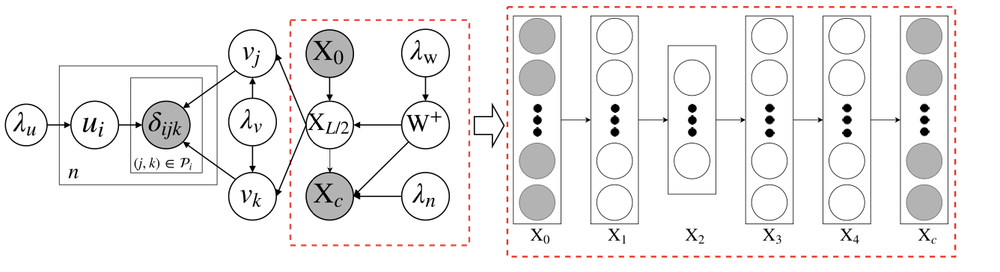
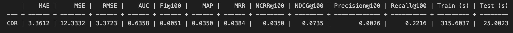
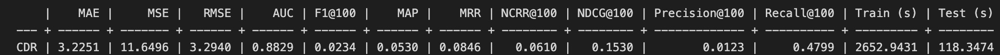
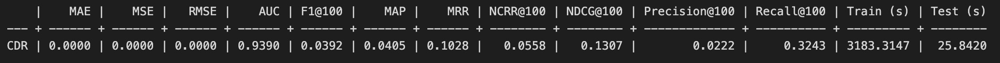
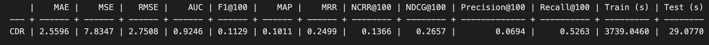

TODO:
- [ ] explain what is the goal of the experiment; write this before you describe the algorithm;
- [ ] this point is still open each table should have a description; for each table and figure that you add, you need to mention which are your main findings/observations; see the Results section at the end of the page; there are many tables but very little description of those

# Introduction
## Collaborative Deep Ranking (CDR) Model
Collaborative Deep Ranking (CDR) is a hybrid recommendation approach with implicit feedback. It employs SDAE to extract deep feature representation from side information and then integrates it into a pair-wise ranking model for alleviating sparsity reduction. 

Above is the graphic model of CDR. SDAE with L = 4 is presented inside the dashed rectangle.

TODO:
- [ ] again, what does SDAE mean?

## Dataset
Since the CDR model requires text modality data, we selected four datasets integrated into the Cornac framework and containing the text auxiliary information, and used an additional dataset, namely the MIND dataset. Below, we briefly introduce all the datasets we use in our experiments.

### Amazon clothing dataset and Amazon digital music dataset
The Amazon product dataset contains reviews (ratings, text, helpfulness votes), product metadata (descriptions, category information, price, brand, and image features), and links (also viewed/also bought graphs) from Amazon, including 142.8 million reviews spanning May 1996 - July 2014. 

From the large Amazon product dataset collection, we choose to use the clothing dataset and the digital music dataset.

We use item description as auxiliary text information for the clothing dataset and the review text as auxiliary text information for the digital music dataset.

### CiteULike dataset
The CiteULike dataset is used in the original paper that proposed the CDL algorithm. The dataset was collected from CiteULike and Google Scholar. CiteULike allows users to create their own collections of articles. Data include abstracts, titles, and tags for each article, and other information like authors, groups, posting time, and keywords. The CiteULike dataset includes 2 sub-datasets - CiteULike-a and CiteULike-t. For these experiments, we use the CiteULike-a from Cornac.

The text information we used includes tile and abstract joined together into one document per item.

### Movienlens 10k dataset
The data was collected through the MovieLens website (movielens.umn.edu) during a seven-month period from September 19th, 1997 through April 22nd, 1998. This dataset consists of 100,000 ratings (1-5) from 943 users on 1682 movies. Each user has rated at least 20 movies. The dataset also contains demographic information of the users, such as age, gender, occupation, zip code.

For this dataset, we used the plot information of movies from the built-in module of Cornac as text modality.

### MIND dataset
The MIND dataset is the additional dataset besides the built-in Cornac datasets. MIcrosoft News Dataset (MIND) is a large-scale dataset for news recommendation research. It was collected from anonymized behavior logs of the Microsoft News website. MIND contains about 160k English news articles and more than 15 million impression logs generated by 1 million users. Every news article contains rich textual content, including title, abstract, body, category, and entities. Each impression log contains the click events, non-clicked events, and historical news click behaviors of this user before this impression. 

We use the news content as the auxiliary text information.

# Experiment
## Setup
1. Prepare dataset: load data in (item id, user id, rating) format
2. Split dataset: Normally we use 20% of the dataset as the test set.
3. Initialize model: we have developed a [script](https://gitlab.ifi.uzh.ch/ddis/Students/Projects/2023-diversity-framework/-/blob/algorithm/cornac/algorithm/cdl/cdl_mind.ipynb) to automate parameters changes, model training and results logging. Basically, we changed parameters like k,v to find the best parameters for both accuracy and diversity. 

TODO:
- [ ] the link does not point to this algorithm

4. Define metrics to evaluate the model: we used all the Cornac built-in metrics to evaluate the accuracy of the model. Besides, we evaluate the diversity of the recommended items on these [addition metrics](https://gitlab.ifi.uzh.ch/ddis/Students/Projects/2023-diversity-framework/-/wikis/home#diversity-metrics).
5. Perform the experiment using the Cornac built-in `Experiment` module.

## Run model on different datasets with various parameters

TODO:
- [ ] this short section with the goal should be moved at the beginning, so that people that open the page understand from the beginning what is the page describing;

### Goal
The goal of these experiments is to find out, for each dataset, the optimal parameters of the model that allows us to recommend accurate and diverse items. We run the CDR model on all available datasets, and evaluate its accuracy and diversity.

### Diversity metrics
To compute the calibration metric, we do not extra features extracted from the textual components of the items. To compute the fragmentation metric, however, we need to detect the stories in our data. We compute the [Calibration diversity metric](/ddis/Students/Projects/2023-diversity-framework/-/wikis/Calibration) and the [Fragmentation diversity metric](/ddis/Students/Projects/2023-diversity-framework/-/wikis/Fragmentation) for the MIND datasets, and calibration for the MovienLens dataset. The higher the value is, the more diverse the recommended items are.

The result of the experiment is shown in the table below. The first column is the name of the model, and the second column refers to the dataset. k, max_iter, lambda_v are some parameters we experiment with. And l2_reg, MAE, MSE, RMSE, AUC, F1, MAP, MRR, NCRR, NDCG, Precision, Recall are the accuracy metrics we used. The diversity metrics we used for evaluation are the calibration (category diversity) and fragmentation metrics. 

| model | data | k   | max_iter | lambda_v | MAE    | MSE    | RMSE   | AUC    | F1     | MAP    | MRR    | NCRR   | NDCG   | Precision | Recall | category diversity  |
|-------|------|-----|----------|----------|--------|--------|--------|--------|--------|--------|--------|--------|--------|-----------|--------|---------------------|
| CDR   | mind | 10  | 10       | 1        | 2.5402 | 7.7245 | 2.7793 | 0.8891 | 0.1134 | 0.1005 | 0.2541 | 0.1323 | 0.1911 | 0.0841    | 0.2953 | 0.06426629289955820 |
| CDR   | mind | 10  | 10       | 2        | 2.5402 | 7.7245 | 2.7793 | 0.8803 | 0.1119 | 0.0946 | 0.2439 | 0.1258 | 0.1842 | 0.0835    | 0.2872 | 0.08916910017933610 |
| CDR   | mind | 10  | 10       | 5        | 2.5402 | 7.7245 | 2.7793 | 0.8583 | 0.0958 | 0.0821 | 0.2305 | 0.1116 | 0.1547 | 0.0732    | 0.2283 | 0.11497776445032100 |
| CDR   | mind | 10  | 10       | 10       | 2.5402 | 7.7245 | 2.7793 | 0.8514 | 0.0925 | 0.0782 | 0.2189 | 0.1050 | 0.1464 | 0.0710    | 0.2155 | 0.08208234425451700 |
| CDR   | mind | 50  | 10       | 1        | 2.5400 | 7.7232 | 2.7791 | 0.9176 | 0.1239 | 0.1099 | 0.2675 | 0.1397 | 0.2074 | 0.0902    | 0.3382 | 0.06498027639087210 |
| CDR   | mind | 50  | 10       | 2        | 2.5401 | 7.7243 | 2.7793 | 0.9102 | 0.1213 | 0.1060 | 0.2612 | 0.1356 | 0.2020 | 0.0888    | 0.3290 | 0.06208617254441030 |
| CDR   | mind | 50  | 10       | 5        | 2.5402 | 7.7245 | 2.7793 | 0.8906 | 0.1138 | 0.0972 | 0.2417 | 0.1260 | 0.1891 | 0.0839    | 0.3061 | 0.06500005179148010 |
| CDR   | mind | 50  | 10       | 10       | 2.5402 | 7.7245 | 2.7793 | 0.8697 | 0.1034 | 0.0890 | 0.2418 | 0.1209 | 0.1724 | 0.0774    | 0.2647 | 0.08985946070831010 |
| CDR   | mind | 100 | 10       | 1        | 2.5397 | 7.7212 | 2.7787 | 0.9235 | 0.1248 | 0.1106 | 0.2569 | 0.1364 | 0.2063 | 0.0907    | 0.3376 | 0.07270572068573    |
| CDR   | mind | 100 | 10       | 2        | 2.5400 | 7.7231 | 2.7790 | 0.9178 | 0.1235 | 0.1073 | 0.2569 | 0.1345 | 0.2035 | 0.0899    | 0.3358 | 0.08059153167561870 |
| CDR   | mind | 100 | 10       | 5        | 2.5401 | 7.7243 | 2.7793 | 0.9046 | 0.1182 | 0.1018 | 0.2509 | 0.1302 | 0.1949 | 0.0869    | 0.3195 | 0.06699443882224800 |
| CDR   | mind | 100 | 10       | 10       | 2.5402 | 7.7245 | 2.7793 | 0.8842 | 0.1106 | 0.0938 | 0.2492 | 0.1251 | 0.1843 | 0.0816    | 0.2992 | 0.06375206664561650 |
| CDR   | mind | 200 | 10       | 1        | 2.5393 | 7.7189 | 2.7783 | 0.9248 | 0.1241 | 0.1095 | 0.2558 | 0.1344 | 0.2037 | 0.0899    | 0.3330 | 0.09655833871228150 |
| CDR   | mind | 200 | 10       | 2        | 2.5397 | 7.7213 | 2.7787 | 0.9196 | 0.1219 | 0.1060 | 0.2563 | 0.1319 | 0.1994 | 0.0888    | 0.3274 | 0.09140564561724220 |
| CDR   | mind | 200 | 10       | 5        | 2.5401 | 7.7238 | 2.7792 | 0.9081 | 0.1175 | 0.0999 | 0.2396 | 0.1244 | 0.1898 | 0.0863    | 0.3131 | 0.09188518768484390 |
| CDR   | mind | 200 | 10       | 10       | 2.5402 | 7.7245 | 2.7793 | 0.8902 | 0.1103 | 0.0932 | 0.2362 | 0.1199 | 0.1806 | 0.0813    | 0.2982 | 0.06918732329481200 |
| CDR   | mind | 300 | 10       | 1        | 2.5395 | 7.7201 | 2.7785 | 0.9251 | 0.1254 | 0.1094 | 0.2471 | 0.1326 | 0.2046 | 0.0908    | 0.3374 | 0.0867996095064963  |
| CDR   | mind | 300 | 10       | 2        | 2.5398 | 7.7221 | 2.7789 | 0.9203 | 0.1228 | 0.1062 | 0.2484 | 0.1303 | 0.1996 | 0.0893    | 0.3287 | 0.09125697269900440 |
| CDR   | mind | 300 | 10       | 5        | 2.5401 | 7.7239 | 2.7792 | 0.9091 | 0.1175 | 0.1003 | 0.2422 | 0.1252 | 0.1903 | 0.0862    | 0.3137 | 0.08300008761162350 |
| CDR   | mind | 300 | 10       | 10       | 2.5402 | 7.7244 | 2.7793 | 0.8912 | 0.1105 | 0.0935 | 0.2443 | 0.1217 | 0.1805 | 0.0817    | 0.2950 | 0.07281482296107360 |
| CDR   | mind | 400 | 10       | 1        | 2.5396 | 7.7206 | 2.7786 | 0.9253 | 0.1254 | 0.1084 | 0.2423 | 0.1305 | 0.2034 | 0.0908    | 0.3387 | 0.084106011201025   |
| CDR   | mind | 400 | 10       | 2        | 2.5398 | 7.7223 | 2.7789 | 0.9205 | 0.1231 | 0.1059 | 0.2458 | 0.1297 | 0.1995 | 0.0896    | 0.3298 | 0.08565173933226680 |
| CDR   | mind | 400 | 10       | 5        | 2.5401 | 7.7240 | 2.7792 | 0.9100 | 0.1179 | 0.0999 | 0.2389 | 0.1237 | 0.1899 | 0.0864    | 0.3144 | 0.08476519524816820 |
| CDR   | mind | 400 | 10       | 10       | 2.5402 | 7.7244 | 2.7793 | 0.8939 | 0.1111 | 0.0948 | 0.2435 | 0.1224 | 0.1820 | 0.0818    | 0.2986 | 0.08115650184656600 |

### Result analysis  
The above table shows that the recall value is the largest when k=50, and lambda=1. So we re-calculate the accuracy with lower lambda_v and a higher number of iterations. Finally we chose the following parameters with better accuracy value:(k=50, autoencoder_structure=[200], max_iter=100, batch_size=128, lambda_u=0.01, lambda_v=0.1,lambda_w=0.0001, lambda_n=5, learning_rate=0.001, vocab_size=8000, seed=123)

Here are the accuracy values with the most optimized parameters on the different datasets:
- amazon clothing dataset

- amazon digital music dataset

- citeulike dataset

- movienlens 10k dataset

From the above figures, we can see that the CDR algorithm has the best accuracy performance on the MovieLens dataset, with a recall value of 0.5263.
Also, we observed that the CDR algorithm has the best diversity performance on parameters k=50, lambda_v=5 with a diversity value of 0.11.

TODO:
- [ ] which diversity metric is described above?
