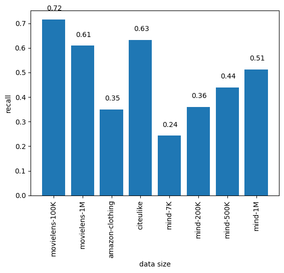
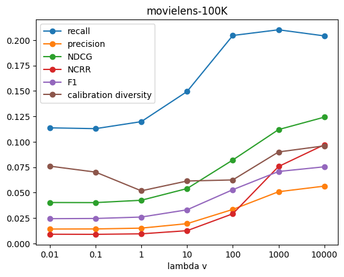
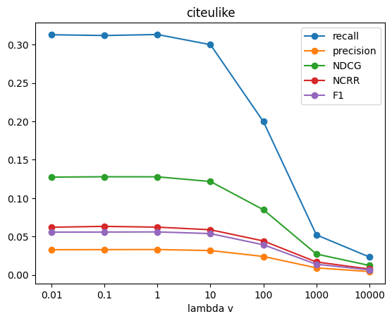
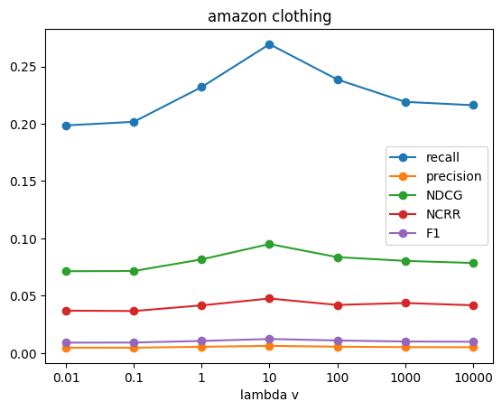

### Goal of experiments with CTR algorithm 
We train the CTR model with various datasets, and compute the metrics including accuracy and diversity metrics. We want to find suitable datasets and hyperparamaters that make CTR model perform better. We also simply calculate calibration and fragmentation diversity metrics with MIND dataset,and observe what influences the results and whether this algorithm is suitable for diversification. 

### Description of the CTR Algorithm
Collaborative topic modeling combines the merits of traditional collaborative filtering and probabilistic topic modeling. The idea of collaborative filtering is to find some similarity (similarity between users or similarity between items) through group behavior, and make decisions and recommendations for users through this similarity. Probailistic topic modeling algorithms are used to discover a set of “topics” from a large collection of documents, where a topic is a distribution over terms that is biased around those associated under a single theme.

Different from traditional rating prediction calculations, this CTR algorithm as described above considers topic proportions $θ_j$, in place of the item latent vector $v_j$:

 $r_{i,j} = (u_i)^T(θ_j + ε_j)$ 
  
where the $ε_j$ is the item latent offset; $θ_j$ ~ $Dirichlet(α)$.

### Datasets
We experimented with 4 Cornac built-in datasets, namely Movielens 100k, Movielens 1M, Amazon Clothing, and Citeulike, and the MIND dataset.

All these datasets are represented as (user-id, item-id, rating) tuples, which are used when training the model, and there is available data file containing item-id and category; we will use these features to compute the diversity metrics.

| Dataset | #Users | #Items | #Ratings |Type | 
| :----: | :----: | :----: | :----:| :----:| 
| Movielens 100K   [(Source)](https://github.com/PreferredAI/cornac/tree/master/cornac/datasets#:~:text=MovieLens%20100k%0A(-,source,-)) 
 | 943 | 1,682 | 100,000 | INT  [1,5]| 
| Movielens 1M   [(Source)](https://github.com/PreferredAI/cornac/tree/master/cornac/datasets#:~:text=MovieLens%201M%0A(-,source,-)) 
 | 6,040 | 3,706 | 1,000,209 | INT  [1,5]| 
| Amazon Clothing   [(Source)](https://github.com/PreferredAI/cornac/tree/master/cornac/datasets#:~:text=Amazon%20Clothing%0A(-,source,-)) 
 | 5,377 | 3,393 | 13,689 | INT  [1,5]|
| Citeulike   [(Source)](https://github.com/PreferredAI/cornac/tree/master/cornac/datasets#:~:text=Citeulike%0A(-,source,-)) 
 | 5,551 | 16,980 | 210,537 | BIN  {0,1}|
| MIND 7K | 181 | 3,156 | 6,263 | BIN  {0,1}|
| MIND 200K | 5,609 | 15,063 | 174,793 | BIN  {0,1}|
| MIND 500K | 12,299 | 19,344 | 381,785 | BIN  {0,1}|
| MIND 1M | 20,875 | 21,924 | 623,091 | BIN  {0,1}|

The datasets formats which are used to train the model are as follows:
('user-id', 'item-id', 'rating'), and we can directly use cornac built-in datasets through importing:

	from cornac.datasets import filmtrust
	ratings = filmtrust.load_feedback()
	Samples from data: [('1', '1', 2.0), ('1', '2', 4.0), ('1', '3', 3.5)] 

### Experiments
#### Setup
1. Prepare datasets: load the feedback as described above; we experiment with data that are mainly text modalities; we use cornac built-in function to convert the texts to be fitted into our model
2. Split datasets: we split our data to train and test data: 80% train data and 20% test data
3. Perform the experiment: choose the model to train, set parameters' values, put into prepared data and define metrics to compute; run the experiments

The following is an example to train the ctr model and compute various metrics:

	import cornac
	from cornac.eval_methods import RatioSplit
	from cornac.data import TextModality
	from cornac.data.text import BaseTokenizer
	from cornac.data import Reader
	from cornac.metrics import MAE,RMSE,MSE,FMeasure,Precision,Recall,NDCG,NCRR,MRR,AUC,MAP

	docs_movielens, item_ids_movielens = cornac.datasets.movielens.load_plot()
	feedback_movielens_100K = cornac.datasets.movielens.load_feedback(variant="100K",reader=Reader(item_set=item_ids_movielens))

	movielens_item_text_modality = TextModality(
    	corpus=docs_movielens,
    	ids=item_ids_movielens,
    	tokenizer=BaseTokenizer(sep="\t", stop_words="english"),
    	max_vocab=8000,
    	max_doc_freq=0.5,
	)
	# Define an evaluation method to split feedback into train and test sets
	movieslens100K_ratio_split = RatioSplit(
    	data=feedback_movielens_100K,
    	test_size=0.2,
    	exclude_unknowns=True,
    	item_text=movielens_item_text_modality,
    	verbose=True,
    	seed=123,
    	rating_threshold=1,
	)
	# Instantiate CTR model
	ctr = cornac.models.CTR(
    	k=10,
    	lambda_u=0.01,
    	lambda_v=0.01,
    	eta=0.01,
    	a=1,
    	b=0.01,
    	max_iter=10,
    	trainable=True,
    	verbose=True,
    	init_params=None,
    	seed=123,
	)
	# Instantiate matrics for evaluation
	metrics = [MAE(), RMSE(), MSE(),FMeasure(k=50),Precision(k=50),
           Recall(k=50), NDCG(k=50), NCRR(k=50),
           MRR(),AUC(), MAP()]
	# Put everything together into an experiment and run it
	cornac.Experiment(eval_method = movieslens100K_ratio_split, models=[ctr], metrics=metrics, user_based=False).run()

#### Run CTR model on different datasets

##### Goal
1. Find suitable datasets

To find out which dataset is more applicable to train CTR model, we set the same hyperparameters with different datasets or different data sizes, and compute _recall_ metric result:

	ctr = cornac.models.CTR(k=50, max_iter=50, lambda_v=1, lambda_u=0.01)
	rec = cornac.metrics.Recall(k=300)

The recall distribution is as follows (**Figure 1**): 

{:height="200px" width="300px"}

As above Figure shows, the x axis stands for different datasets, e.g., _movielens-100k_ means movielens data with 100K size. The y axis is the _recall_ result. The higher the y value is, the more accurate the CTR model performs on this dataset.

2. Find suitable hyperparameters

As the paper [1] indicates, articles with large offsets enjoy readership from different areas, which means that 𝜆v (lambda_v) may influence the metric results. So we test with different values of it as the paper suggests. The following three figures stand for metric results from different 𝜆v on _movielens-100K_, _citeulike_, _amazon clothing_ datasets. We can see that with the increase of 𝜆v, all evaluation results increase on movielens data and varies on citeulike and amazon clothing, but the evaluation trend is similar for each dataset. From these results, we can choose suitable parameters to train CTR model, and prepare for diversity metric calculation.
{:height="150px" width="230px"} {:height="150px" width="230px"} {:height="150px" width="230px"}

#### Run CTR model on the MIND dataset 
##### Goal
We experimented with the CTR model on the MIND news dataset, which includes some features like category, story, etc. as the **Table** shows. The goal of this experiment is to find out whether this algorithm is suitable for diversification.

| user-id | item-id | rating | date | category | url | text | entities | sentiment | complexity | story |
| :----: | :----: | :----: | :----:| :----:| :----:| :----:| :----:| :----:| :----:| :----:|
| U13740 | N55189 | 1 | 2019-10-15 | tv | https://assets.msn.com/labs/mind/AAIORni.html | We’d like to solve the puzzle, Pat: Blair Davi... | [{'text': 'Cardiff', 'alternative': ['Cardiff'... | 0.091856 | 62.17 | 766.0 |
| U13740 | N42782 | 1 | 2019-10-19 | sports | https://assets.msn.com/labs/mind/AAJ1mE9.html | The Yankees forced a Game 6 on Friday as it to... | [{'text': 'second', 'alternative': ['second'],... | 0.028105 | 73.92 | 444.0 |
	
##### Setup

	# change k value: 25~200
	# change lambda_v value: 0.01~1,000
	ctr = cornac.models.CTR(k=50, max_iter=50, lambda_v=1, lambda_u=0.01)

##### Diversity metric
In this experiment, we mainly compute [Calibration diversity metric ](Calibration) and [Fragmentation diversity metric](Fragmentation). The higher the value is, the more diverse the set of recommended items is.

##### Results
In the paper [1], it indicates that the users that receive only a few recommended articles tend to have a higher diversity of recommendations. To better understand this, we test with different values of top k items **@TOPK** that are recommended to users on the MIND dataset, and prove this finding (see **Figure 5(1)**): the fewer top k recommended items are, the higher the diversity metric results are.

In addition, they have found that a less popular article might also have a high offset value $ε_j$. In this case, it changes the actual magnitude in $θ_j$ , but does not bring in other topics. As inspiration, we change the parameter lambda_v, to observe the change of diversity of it (see **Figure 5(2)**), we can see that as the lambda_v increases, the diversity metric results increase (when lambda_v <= 100).

"){:height="200px" width="280px"}"){:height="200px" width="300px"}

### Summary
We first train CTR model on different datasets, and find suitable dataset and applicable hyperparameters, then we test it with diversity metrics, and find out that with decreasing of the amount of recommended items, and increasing of lambda_v, the larger the diversity metric results are, which means more diverse the recommendations are. As the recalls are low, and almost near zero, we need to do more experiments to get conclusions whether CTR algorithm is suitable for diversification.

### Reference
[1] Wang, C. and Blei, D.M. (2011) ‘Collaborative topic modeling for recommending scientific articles’, Proceedings of the 17th ACM SIGKDD international conference on Knowledge discovery and data mining [Preprint]. doi:10.1145/2020408.2020480. 

~~~~