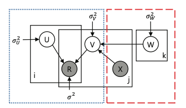
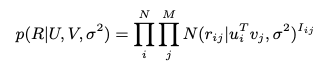
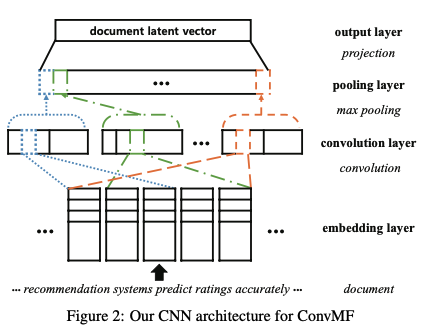
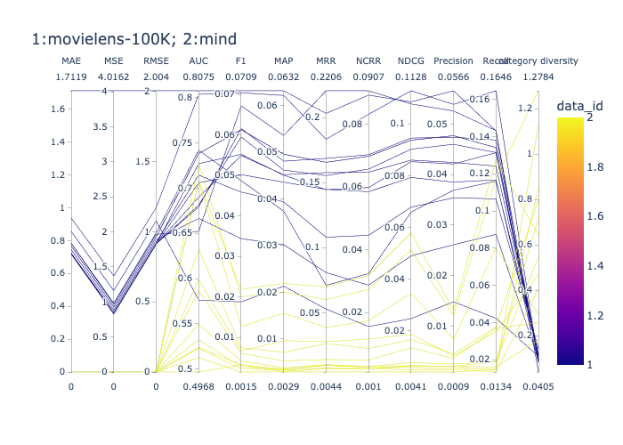
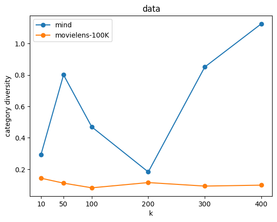

### Goal of experiments with ConvMF algorithm
We train the ConvMF model with various datasets, and compute the metric results including accuracy and diversity metrics. We want to find suitable datasets that make HFT model perform better and compare diversity metric results of the datasets.

### Description of the ConvMF Algorithm
Sparseness of user-to-item rating data is one of the major factors that deteriorate the quality of recommender system. To handle the sparsity problem, several recommendation techniques have been proposed, including matrix factorization. However, many researches have proven that contexts are also important besides users' ratings. But vonvolutional matrix factorization (ConvMF) integrates convolutional neural network (CNN) into probabilistic matrix factorization (PMF), which is a kind of context-aware recommendation model.

**Figure 1** is the graphical model of ConvMF model: PMF part is in the left (dotted-blue); CNN part is in the right (dashed-red).

{:height="300px" width=250px"}

**Probabilistic Model of ConvMF**

Suppose we have $N$ users and $M$ items, and observed ratings are represented by $R ∈ R^{N×M}$ matrix. Then, our goal is to find user and item latent models ($U ∈ R^{k×N}$ and $V ∈ R^{k×M}$) whose product ($U^TV$) reconstructs the rating matrix $R$. In probabilistic point of view, the conditional distribution over observed ratings is given by

where $N(x|μ,σ^2)$ is the probability density function of the Gaussian normal distribution with mean $μ$ and variance $σ^2$, and $I_{i,j}$ is an indicator function.

**CNN Architecture of ConvMF**

The objective of the CNN architecture is to generate document latent vectors from documents of items, which are used to compose the item latent models with epsilon variables. **Figure 2** shows our CNN architecture that consists of four layers; 1) embedding layer, 2) convolution layer, 3) pooling layer, and 4) output layer.

{:height="300px" width="400px"}

### Datasets
| Dataset | #Users | #Items | #Ratings |Type | 
| :----: | :----: | :----: | :----:| :----:| 
| Movielens 100K   [(Source)](https://github.com/PreferredAI/cornac/tree/master/cornac/datasets#:~:text=MovieLens%20100k%0A(-,source,-)) 
 | 943 | 1,682 | 100,000 | INT  [1,5]| 
| MIND 10K | 272 | 3,942 | 9,247 | BIN  {0,1}|

_Movielens-100K_ dataset is as the following Table shows (because of the edition limits, we only show some parts of categories). ItemID is the ID of the item, the first three columns are information of movies, and the rest are movie categories: '1' means the movie includes this category.

| ItemID | Title | Release Date | Action | Adventure | Animation | Children's | Comedy | Crime | Documentary | Drama | Fantasy | Film-Noir | Horror | Musical |
|:----:|:----:|:----:|:----:|:----:|:----:|:----:|:----:|:----:|:----:|:----:|:----:|:----:|:----:|:----:|
| 1309 | Very Natural Thing, A (1974) | 01-Jan-1974 | 0 | 0 | 0 | 0 | 0 | 0 | 0 | 1 | 0 | 0 | 0 | 0 | 
| 814 | Great Day in Harlem, A (1994) | 01-Jan-1994 | 0 | 0 | 0 | 0 | 0 | 0 | 1 | 0 | 0 | 0 | 0 | 0 | 

_MIND_ dataset is like:

| user-id | item-id | rating | date | category | url | text | entities | sentiment | complexity | story |
| :----: | :----: | :----: | :----:| :----:| :----:| :----:| :----:| :----:| :----:| :----:|
| U13740 | N55189 | 1 | 2019-10-15 | tv | https://assets.msn.com/labs/mind/AAIORni.html | We’d like to solve the puzzle, Pat: Blair Davi... | [{'text': 'Cardiff', 'alternative': ['Cardiff'... | 0.091856 | 62.17 | 766.0 |
| U13740 | N42782 | 1 | 2019-10-19 | sports | https://assets.msn.com/labs/mind/AAJ1mE9.html | The Yankees forced a Game 6 on Friday as it to... | [{'text': 'second', 'alternative': ['second'],... | 0.028105 | 73.92 | 444.0 |

### Experiments
#### Setup
1. Prepare datasets: load the feedback as described above; we experiment with data that are mainly text modalities; we use cornac built-in function to convert the texts to be fitted into our model
2. Split datasets: we split our data to train and test data: 80% train data and 20% test data
3. Perform the experiment: choose the model to train, set parameters' values, put into prepared data and define metrics to compute; run the experiments

The following is an example to train the hft model with MIND dataset and compute various metrics:

	import cornac
	from cornac.eval_methods import RatioSplit
	from cornac.data import TextModality
	from cornac.data.text import BaseTokenizer
	from cornac.data import Reader
	from cornac.metrics import MAE,RMSE,MSE,FMeasure,Precision,Recall,NDCG,NCRR,MRR,AUC,MAP

	# pre-process data
	mind_feedback = mind_.loc[:, ['user_id','item_id','rating']]
	# feedback = cornac.data.Dataset.from_uir(mind_feedback.itertuples(index=False))
	feedback = mind_feedback.apply(lambda x: tuple(x), axis=1).values.tolist()
	text = list(mind_['text'])
	item_ids = list(mind_['item_id'])	
	# Instantiate a TextModality, it makes it convenient to work with text auxiliary information
	item_text_modality = TextModality(
    	corpus=text,
    	ids=item_ids,
    	tokenizer=BaseTokenizer(sep=" ", stop_words="english"),
    	max_vocab=8000,
    	max_doc_freq=0.5,
	)
	# Define an evaluation method to split feedback into train and test sets
	mind_ratio_split = RatioSplit(
    	data=feedback,
    	test_size=0.2,
    	exclude_unknowns=True,
    	item_text=item_text_modality,
    	verbose=True,
    	seed=123,
    	rating_threshold=0.5,
	)
	# Instantiate ConvMF model
	convmf = cornac.models.ConvMF(
    	k=10,
    	n_epochs=10,
    	cnn_epochs=5,
    	cnn_bs=128,
    	cnn_lr=0.001,
    	lambda_u=1,
    	lambda_v=100,
    	emb_dim=200,
    	max_len=300,
    	filter_sizes=[3, 4, 5],
    	num_filters=100,
    	hidden_dim=200,
    	dropout_rate=0.2,
    	give_item_weight=True,
    	trainable=True,
    	verbose=True,
    	seed=123,
	)
	# Instantiate metrics for evaluation
	metrics = [MAE(), RMSE(), MSE(),FMeasure(k=50),Precision(k=50),
           Recall(k=50), NDCG(k=50), NCRR(k=50),
           MRR(),AUC(), MAP()]
	# Put everything together into an experiment and run it
	cornac.Experiment(
    	eval_method=mind_ratio_split, models=[convmf], metrics=metrics, user_based=False
	).run()

### Run ConvMF model on different datasets with various params
The most influenced factors on ConvMF model are laten factor k, lambda_u and lambda_v. So we mainly adjust the three params to observe metric results. 

##### Setup

	# change k value: 10~400
	# change lambda_u value: 1~1000
	# change lambda_v value: 1~1000
	convmf = cornac.models.ConvMF(
    	k=10,
    	n_epochs=10,
    	lambda_u=1,
    	lambda_v=100,
    	seed=123,
	)

##### Diversity metric
In this experiment, we mainly compute [Calibration diversity metric ](Calibration) and [Fragmentation diversity metric](Fragmentation). The higher the value is, the more diverse of the recommended items.

The most influenced factors on Conv_Mf model are laten factor k, lambda_u and lambda_v. So we mainly adjust the three parameters to observe metric results. One example from ***mind*** datasets is shown below (**Table**). The first three columns are the parameters, and the rest columns are all metric results produced by ConvMF models with related parameters.

For better understanding of the results, we visualize the results of mind and movielens datasets as parallel graph as **Figure3** and **Figure4** show. The first figure shows the difference of metric results from _movielens-100K_ and _MIND_ datasets: the x axis stands for various metrics (MSE, AUC, etc.), and the color stands for dataset kind (purple stands for movielens-100K dataset, and yellow stands for MIND). The second figure is the comparison on calibration metric results between two datasets with the change of latent factor k: the x axis is k value , and the y axis is metric result.

| k | lambda_u | lambda_v | AUC | F1 | MAP | MRR | NCRR | NDCG | Precision | Recall | category diversity | story diversity |
| ------ | ------ | ------ | ------ | ------ | ------ | ------ | ------ |------ | ------ |------ | ------ |------ |
| 10 | 1 | 100 | 0.7076 | 0.0127 | 0.0155 | 0.0386 | 0.0174 | 0.0345 | 0.0074 | 0.0803 | 0.29247192905736735 | 0.01035529639060549 |
| 50 | 1 | 100 | 0.6326 | 0.0075 | 0.0071 | 0.0263 | 0.0085 | 0.0166 | 0.0045 | 0.0375 | 0.8008326771683433 | 0.006183437883283891 |
| 100 | 1 | 100 | 0.5988 | 0.0067 | 0.0096 | 0.0277 | 0.0115 | 0.0186 | 0.0041 | 0.0351 | 0.46940804354865584 | 0.04124357224816788 |
| 200 | 1 | 100 | 0.524 | 0.0033 | 0.0035 | 0.0094 | 0.0025 | 0.0066 | 0.002 | 0.0161 | 0.18257364988818273 | 0.006560904486574628 |
| 300 | 1 | 100 | 0.5323 | 0.0028 | 0.0034 | 0.01 | 0.0025 | 0.0058 | 0.0017 | 0.0148 | 0.8507972796334449 | 0.013198428315189702 |
| 400 | 1 | 100 | 0.5127 | 0.0015 | 0.0029 | 0.0044 | 0.001 | 0.0041 | 0.0009 | 0.0148 | 1.1256427597095529 | 0.01822516777978173 |
| 300 | 10 | 100 | 0.5495 | 0.0042 | 0.0038 | 0.01 | 0.0028 | 0.0077 | 0.0025 | 0.0189 | 0.7161166988128607 | 0.008274452692399906 |
| 300 | 100 | 100 | 0.5866 | 0.0061 | 0.0053 | 0.014 | 0.0048 | 0.0135 | 0.0036 | 0.0367 | 0.25739493466368873 | 0.0017053178693166283 |
| 300 | 1000 | 100 | 0.523 | 0.0023 | 0.0033 | 0.0077 | 0.002 | 0.005 | 0.0014 | 0.0134 | 0.40605035368034664 | 0.0005968325217134946 |
| 300 | 100 | 10 | 0.7082 | 0.0219 | 0.0219 | 0.0698 | 0.0318 | 0.0579 | 0.0131 | 0.1276 | 0.642391776751164 | 0.005750565245649905 |
| 300 | 100 | 1 | 0.7276 | 0.0201 | 0.02 | 0.0601 | 0.0274 | 0.0513 | 0.0121 | 0.1173 | 1.2784116139858985 | 6.106475349412906e-06 |
| 300 | 100 | 1000 | 0.4968 | 0.0033 | 0.003 | 0.0071 | 0.0019 | 0.0064 | 0.002 | 0.019 | 0.5460548494459008 | 0.007949768042644002 |

{:height="400px" width=450px"}{:height="200px" width="350px"}

#### Results 
As shown in **Figure 3** and **Figure 4**, we can observe that the accuracy metric results from movielens-100K are higher than mind generally, while diversity is lower than mind.

### Reference
Kim, D. et al. (2016) ‘Convolutional matrix factorization for document context-aware recommendation’, Proceedings of the 10th ACM Conference on Recommender Systems [Preprint]. doi:10.1145/2959100.2959165. 
