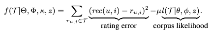
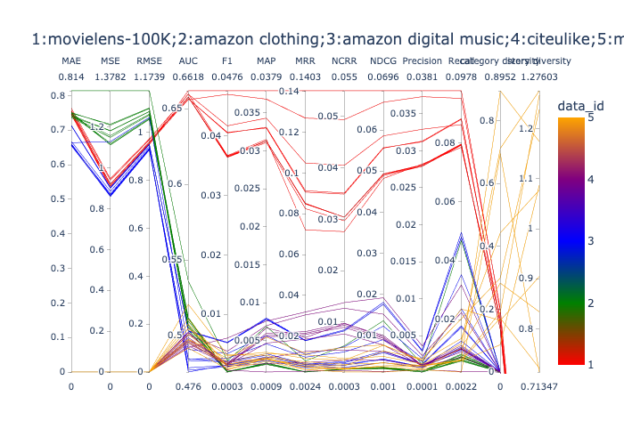
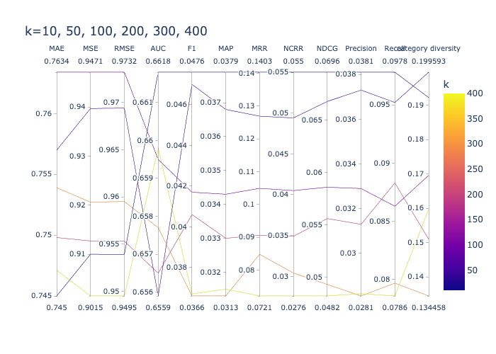

### Goal of experiments with HFT algorithm
We train the HFT model with various datasets, and compute the metric results including accuracy and diversity metrics. We want to find suitable datasets and hyperparamaters that make HFT model perform better. 

### Description of the HFT Algorithm
HFT algorithm, which is name as ‘Hidden Factors as Topics’, or HFT for short, considers human feedbacks when giving recommendations, not only ratings from users. Unlike supervised topic models (for example), that learn topics that are correlated with an output variable, HFT discovers topics that are correlated with the ‘hidden factors’ of products and users, $γ_i$ and $γ_u$. As the authors said in the paper, ignoring this rich source of information (reviews) is a major shortcoming of existing work on recommender systems. So this algorithm considers how hidden ratings relate to hidden review dimensions. 

The goal of HFT algorithm is to simultaneously optimize the parameters associated with ratings $Θ = {α, β_u, β_i, γ_u, γ_i}$ and the parameters associated with topics $Φ = {θ, φ}$. That is, given our review and rating corpus $T$, our objective is to find:

  

  

where $Θ$ and $Φ$ are rating and topic parameters (respectively), $κ$ controls the transform, and $z$ is the set of topic assignments for each word in the corpus $T$; both $Θ$ and $Φ$ depend on $γ$.

### Datasets
| Dataset | #Users | #Items | #Ratings |Type | 
| :----: | :----: | :----: | :----:| :----:| 
| Movielens 100K   [(Source)](https://github.com/PreferredAI/cornac/tree/master/cornac/datasets#:~:text=MovieLens%20100k%0A(-,source,-)) 
 | 943 | 1,682 | 100,000 | INT  [1,5]| 
| Amazon Digital Music   [(Source)](http://jmcauley.ucsd.edu/data/amazon/)) 
 | 5,541 | 3,568 | 64,706 | INT  [1,5]| 
| Amazon Clothing   [(Source)](https://github.com/PreferredAI/cornac/tree/master/cornac/datasets#:~:text=Amazon%20Clothing%0A(-,source,-)) 
 | 5,377 | 3,393 | 13,689 | INT  [1,5]|
| Citeulike   [(Source)](https://github.com/PreferredAI/cornac/tree/master/cornac/datasets#:~:text=Citeulike%0A(-,source,-)) 
 | 5,551 | 16,980 | 210,537 | BIN  {0,1}|
| MIND 10K | 272 | 3,942 | 9,247 | BIN  {0,1}|

### Experiments
#### Setup
1. Prepare datasets: load the feedback as described above; we experiment with data that are mainly text modalities; we use cornac built-in function to convert the texts to be fitted into our model
2. Split datasets: we split our data to train and test data: 80% train data and 20% test data
3. Perform the experiment: choose the model to train, set parameters' values, put into prepared data and define metrics to compute; run the experiments

The following is an example to train the hft model with MIND dataset and compute various metrics:

	import cornac
	from cornac.eval_methods import RatioSplit
	from cornac.data import TextModality
	from cornac.data.text import BaseTokenizer
	from cornac.data import Reader
	from cornac.metrics import MAE,RMSE,MSE,FMeasure,Precision,Recall,NDCG,NCRR,MRR,AUC,MAP

	# pre-process data
	mind_feedback = mind_.loc[:, ['user_id','item_id','rating']]
	# feedback = cornac.data.Dataset.from_uir(mind_feedback.itertuples(index=False))
	feedback = mind_feedback.apply(lambda x: tuple(x), axis=1).values.tolist()
	text = list(mind_['text'])
	item_ids = list(mind_['item_id'])
	# Instantiate a TextModality, it makes it convenient to work with text auxiliary information
	item_text_modality = TextModality(
    	corpus=text,
    	ids=item_ids,
    	tokenizer=BaseTokenizer(sep=" ", stop_words="english"),
    	max_vocab=8000,
    	max_doc_freq=0.5,
	)
	# Define an evaluation method to split feedback into train and test sets
	mind_ratio_split = RatioSplit(
    	data=feedback,
    	test_size=0.2,
    	exclude_unknowns=True,
    	item_text=item_text_modality,
    	verbose=True,
    	seed=123,
    	rating_threshold=0.5,
	)
	# Instantiate HFT model
	hft = cornac.models.HFT(
   	 	k=10,
    	max_iter=10,
    	grad_iter=5,
    	l2_reg=0.001,
    	lambda_text=0.01,
    	vocab_size=8000,
    	seed=123,
	)
	# Instantiate metrics for evaluation
	metrics = [MAE(), RMSE(), MSE(),FMeasure(k=50),Precision(k=50),
           Recall(k=50), NDCG(k=50), NCRR(k=50),
           MRR(),AUC(), MAP()]
	# Put everything together into an experiment and run it
	cornac.Experiment(
    	eval_method=mind_ratio_split, models=[hft], metrics=metrics, user_based=False
	).run()

### Run HFT model on different datasets with various params
The most influenced factors on HFT model are laten factor k, lambda_text and l2_reg. So we mainly adjust the three params to observe metric results. 

##### Setup

	# change k value: 10~400
	# change lambda_text value: 0.01~0.1
	# change l2_reg value: 0.001~0.1
	hft = cornac.models.HFT(
   	 	k=10,
    	max_iter=10,
    	grad_iter=5,
    	l2_reg=0.001,
    	lambda_text=0.01,
    	vocab_size=8000,
    	seed=123,
	)

##### Diversity metric
In this experiment, we mainly compute [Calibration diversity metric ](Calibration) and [Fragmentation diversity metric](Fragmentation). The higher the value is, the more diverse of the recommended items.

One example from ***mind*** datasets is shown below (**Table**). For better understanding of the results, we visualize it as parallel graph where **Figure 1** and **Figure 2** show. In the table, the first three columns are parameters k, lambda_text and l2_reg that we adjust, and the rest columns are all accuracy and diversity metric results. In the below two pictures, the first figure shows the difference of metric results from all datasets, _movielens-100K_, _amazon clothing_, _amazon music_, _citeulike_, _MIND_: the x axis stands for various metrics, and the color stands for dataset kind; the second figure shows how metric results change with different latent factor k: the x axis stands for various metrics, and the color stands for results from HFT models with k=10, 50, 100, 200, 300, 400.

| k | lambda_text | l2_reg | AUC | F1 | MAP | MRR | NCRR | NDCG | Precision | Recall | category diversity | story diversity |
| ------ | ------ | ------ | ------ | ------ | ------ | ------ | ------ |------ | ------ |------ | ------ |------ |
| 10 | 0.01 | 0.001 | 0.5047 | 0.003 | 0.0035 | 0.0091 | 0.0026 | 0.0075 | 0.0017 | 0.0236 | 0.16396560474705105 | 0.9045115577052535 |
| 50 | 0.01 | 0.001 | 0.4918 | 0.0008 | 0.0026 | 0.0059 | 0.0011 | 0.0021 | 0.0005 | 0.0063 | 0.19043215399053856 | 1.26721602019834 |
| 100 | 0.01 | 0.001 | 0.5207 | 0.0032 | 0.0031 | 0.0064 | 0.0015 | 0.0061 | 0.0019 | 0.0203 | 0.2994482672296015 | 1.238645938432165 |
| 200 | 0.01 | 0.001 | 0.5009 | 0.0016 | 0.0028 | 0.0074 | 0.0018 | 0.0032 | 0.001 | 0.006 | 0.17147534416801316 | 0.7212621544088905 |
| 300 | 0.01 | 0.001 | 0.5078 | 0.0007 | 0.0023 | 0.0036 | 0.0003 | 0.001 | 0.0004 | 0.0022 | 0.6952346382870473 | 0.7134748246574826 |
| 400 | 0.01 | 0.001 | 0.5111 | 0.0011 | 0.0027 | 0.0036 | 0.001 | 0.0033 | 0.0006 | 0.0104 | 0.2829768282174946 | 0.833893953804446 |
| 50 | 0.1 | 0.001 | 0.5048 | 0.002 | 0.0033 | 0.0109 | 0.0029 | 0.0048 | 0.0012 | 0.0118 | 0.7117619035128504 | 1.2760288635067285 |
| 10 | 0.1 | 0.001 | 0.4974 | 0.0016 | 0.0027 | 0.0048 | 0.0008 | 0.0025 | 0.001 | 0.0064 | 0.8952004524817146 | 1.1745088443207166 |
| 50 | 0.01 | 0.01 | 0.4976 | 0.0026 | 0.0055 | 0.0116 | 0.0051 | 0.0076 | 0.0016 | 0.0136 | 0.443079039674977 | 1.077328362262056 |
| 50 | 0.01 | 0.1 | 0.4957 | 0.0014 | 0.0025 | 0.0051 | 0.0009 | 0.0025 | 0.0009 | 0.006 | 0.08683283281052173 | 1.0871930964606356 |

{:height="300px" width="400px"}{:height="300px" width="400px"}

##### Results
From **Figure 1**, we can observe that movielens-100K data is more applicable to HFT algorithm compared to other 4 datasets, while mind data has a higher diversity value.
Next we research whether k, the latent factor influences metric results of HFT algorithm: from **Figure 2**, we can observe that the as K increases (50, 100, 200, 300, 400), MSE, AUC, recall, etc. results decrease, however, diversity results increase. So later maybe we can find balanced parameters, and optimize it with diversity function.

### Summary
We first train HFT model on different datasets, and find that _movielens-100k_ is more suitable for HFT as the accuracy metric results are larger. Also, HFT model performs better with less latent factor k, higher lambda_text value and medium l2_reg value, though the results have little change.

### Reference
McAuley, J. and Leskovec, J. (2013) ‘Hidden factors and hidden topics’, Proceedings of the 7th ACM conference on Recommender systems [Preprint]. doi:10.1145/2507157.2507163. 