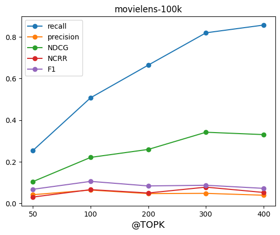

### Goal
We implement and integrate a [new diversity algorithm](https://github.com/cydonia999/variational-autoencoders-for-collaborative-filtering-pytorch) into the Cornac framework, based on the paper proposed by [Liang et al.](https://arxiv.org/abs/1802.05814). We evaluate the accuracy and the diversity of the recommended items on several datasets already integrated in Cornac, and on additional datasets: _Movielens_, _MIND_, _Citeulike_, _Amazon Clothing_, _Amazon Digital Music_.

### Description of the DAE model
In the recommender systems domain, collaborative filtering is a widely-used technique. However, the linear factor models, which largely dominate the collaborative filtering approaches, limit the capacity of models. Thus, this proposed algorithm extends variational autoencoders to collaborative filtering by applying non-linear probabilistic models. This generative model uses multinomial likelihood and Bayesian inference for parameter estimation.

#### [Model definition](https://gitlab.ifi.uzh.ch/ddis/Students/Projects/2023-diversity-framework/-/blob/algorithm_vae/cornac/models/dae/dae.py)
__Notations__: We use $u \in \{1,\dots,U\}$ to index users and $i \in \{1,\dots,I\}$ to index items. In the context of this algorithm, we consider learning with implicit feedback. The user-by-item interaction matrix is the click matrix $X \in N^{U\times I}$. The lower case $x_u =[X_{u1},\dots,X_{uI}]^\top \in N^I$ is a bag-of-words vector with the number of clicks for each item from user u.

__Generative process__: For each user $u$, the model starts by sampling a $K$-dimensional latent representation $z_u$ from a standard Gaussian prior. The latent representation $z_u$ is transformed via a non-linear function $f_θ (\cdot) \in R^I$ to produce a probability distribution over $I$ items $\pi (z_u)$ from which the click history $x_u$ is assumed to have been drawn:

$$
\mathbf{z}_u \sim \mathcal{N}(0, \mathbf{I}_K),  \pi(\mathbf{z}_u) \propto \exp\{f_\theta (\mathbf{z}_u\},\\
\mathbf{x}_u \sim \mathrm{Mult}(N_u, \pi(\mathbf{z}_u))
$$

The objective for Multi-DAE for a single user $u$ is:
$$
\mathcal{L}_u(\theta, \phi) = \log p_\theta(\mathbf{x}_u | g_\phi(\mathbf{x}_u))
$$
where $g_\phi(\cdot)$ is the non-linear "encoder" function.

### Datasets
We experimented with 4 Cornac built-in datasets, namely Movielens 100k, Movielens 1M, Amazon Clothing, Amazon Digital Music and Citeulike, and the MIND news dataset.

| Dataset | #Users | #Items | #Ratings |Type | 
| :----: | :----: | :----: | :----:| :----:| 
| Movielens 100K   [(Source)](https://github.com/PreferredAI/cornac/tree/master/cornac/datasets#:~:text=MovieLens%20100k%0A(-,source,-)) 
 | 943 | 1,682 | 100,000 | INT  [1,5]| 
| Movielens 1M   [(Source)](https://github.com/PreferredAI/cornac/tree/master/cornac/datasets#:~:text=MovieLens%201M%0A(-,source,-)) 
 | 6,040 | 3,706 | 1,000,209 | INT  [1,5]| 
| Amazon Clothing   [(Source)](https://github.com/PreferredAI/cornac/tree/master/cornac/datasets#:~:text=Amazon%20Clothing%0A(-,source,-)) 
 | 5,377 | 3,393 | 13,689 | INT  [1,5]|
| Amazon Digital Music   [(Source)](http://jmcauley.ucsd.edu/data/amazon/) 
 | 5,541 | 3,568 | 64,706 | INT  [1,5]|
| Citeulike   [(Source)](https://github.com/PreferredAI/cornac/tree/master/cornac/datasets#:~:text=Citeulike%0A(-,source,-)) 
 | 5,551 | 16,980 | 210,537 | BIN  {0,1}|
| MIND 10K | 272 | 3,942 | 9,247 | BIN  {0,1}|
| MIND 200K | 5,609 | 15,063 | 174,793 | BIN  {0,1}|

### Experiments
#### Setup
1. Prepare datasets: load the feedback; we use cornac built-in dataset such as _Movielens-100K_
2. Split datasets: we split our data to train and test data: 80% train data and 20% test data
3. Perform the experiment: choose the model to train, set parameters' values, put into prepared data and define metrics to compute; run the experiments

(Usage example is [here](https://gitlab.ifi.uzh.ch/ddis/Students/Projects/2023-diversity-framework/-/blob/algorithm_vae/examples/dae_movielens.py))

Model Parameters: The generative function is a [200 -> n_items] MLP, thus the overall architecture for the Multi-DAE is [n_items -> 200 -> n_items].

	# Load user-item feedback
	movielens_feedback = cornac.datasets.movielens.load_feedback(variant="100K")

	# Instantiate an evaluation method to split data into train and test sets.
	ratio_split = RatioSplit(
    	data=movielens_feedback,
    	test_size=0.2,
    	exclude_unknowns=True,
    	verbose=True,
    	seed=123,
    	rating_threshold=0.5,
	)
	# Instantiate the DAE model
	dae = cornac.models.DAE(
   		qk_dims=[200],
  		pk_dims=[200],
    	n_epochs=100,
    	batch_size=100,
    	learning_rate=0.001,
    	weight_decay=0.0,
    	dropout_p=0.5,
    	seed=123,
    	use_gpu=True,
    	verbose=True,
	)

We compute all accuracy metrics built in cornac and run the experiments:

	# Instantiate evaluation measures
	metrics = [MAE(), RMSE(), MSE(),FMeasure(k=300),Precision(k=300),
           	Recall(k=300), NDCG(k=300), NCRR(k=300),
           	MRR(),AUC(), MAP()]

	# Put everything together into an experiment and run it
	cornac.Experiment(
    	eval_method=ratio_split,
    	models=[dae],
    	metrics=metrics,
    	user_based=True,
	).run()

### Results

We compute all accuracy metrics using trained DAE model with various datasets, and get following results, '@TOPK' means the previous topK results to all relevant results. On movielens-100K dataset, we adjust different @TOPK value as **Figure 1** shows. We can see that it has great influence on _Recall_ and _NDCG_ results: with @TOPK increasing, the accuracy results increase, too.

| Dataset |    MAE |    MSE |   RMSE |    AUC | F1@300 |    MAP |    MRR | NCRR@300 | NDCG@300 | Precision@300 | Recall@300 | Train (s) | Test (s) |
| :----: | :----: | :----: | :----:| :----:| :----:| :----:| :----:| :----:| :----:| :----:| :----:| :----:| :----:|
| Movielens-100K | 1.5703 | 3.5660 | 1.8142 | 0.9337 | 0.0868 | 0.0802 | 0.0813 |   0.0777 |   0.3419 |  0.0478 | 0.8203 | 4.4301 | 3.8157 |
| Movielens-1M | 1.4478 | 3.1806 | 1.7245 | 0.9282 | 0.0856 | 0.0642 | 0.0603 |   0.0583 |   0.2788 | 0.0490 |0.6472 | 55.5943 | 46.5148 |
| Citeulike |  0.0000 | 0.0000 | 0.0000 | 0.9504 | 0.0280 | 0.0354 | 0.0346 |   0.0347 |   0.1906 |        0.0147 |  0.6174 |  202.5067 |  72.5447 |
| Amazon Clothing |  2.8308 | 9.9588 | 2.8531 | 0.6500 | 0.0028 | 0.0327 | 0.0359 |   0.0332 |   0.0917 | 0.0014 | 0.3644 |   45.6439 | 2.3799 |
| Amazon Digital Music |  1.8430 | 5.4002 | 2.0170 | 0.8916 | 0.0122 | 0.0398 | 0.0491 |   0.0427 |   0.1727 | 0.0063 | 0.6706 | 50.8588 | 7.4137 |
| MIND-10K |  0.0000 | 0.0000 | 0.0000 | 0.7345 | 0.0115 | 0.0123 | 0.0262 |   0.0153 |   0.0902 |        0.0059 | 0.3568 | 3.5160 | 0.6845 |
| MIND-200K |  0.0000 | 0.0000 | 0.0000 | 0.8911 | 0.0223 | 0.0495 | 0.0860 |   0.0621 |   0.1510 |        0.0120 | 0.4094 | 195.5282 | 54.8801 |

{:height="300px" width="400px"}

### Conclusion
We implement the Multi-likelihood denoising autoencoder into cornac, and experiment with cornac built-in datasets. We also adjust the parameters defined in this model to observe results.

### Refernce
Dawen Liang, Rahul G. Krishnan, Matthew D. Hoffman, Tony Jebara. Variational Autoencoders for Collaborative Filtering, The Web Conference (WWW), 2018. [arXiv](https://arxiv.org/abs/1802.05814), [github](https://github.com/dawenl/vae_cf)

