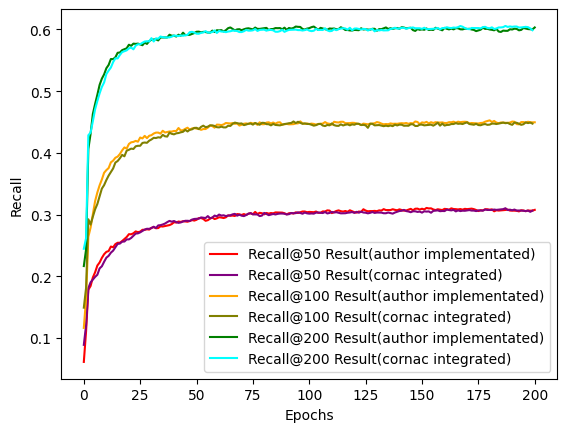

### Goal

In recent years, the field of recommender systems has witnessed a paradigm shift
with the emergence of neural recommendation models. These models leverage
complex neural architectures to capture patterns in user-item interactions, lead-
ing to more accurate and personalized recommendations. One key challenge in
this domain has been the efficient handling of vast amounts of data, especially in
scenarios involving implicit user feedback.
Traditional methods for training neural recommendation models often rely on sam-
pling procedures to cope with large-scale datasets. However, this approach intro-
duces inherent limitations, such as the potential loss of valuable information due
to sampling bias. In response to this challenge, we implemented the Neural Matrix
Factorization without Sampling (ENMF) method proposed by Chen et al. (2020).
This approach offers a clear advantage—it can converge to a more stable and op-
timal solution without introducing sampling bias.

### Description of the ENMF Algorithm

In implicit data, the user-item interactions $R$ is defined as 
<!-- $$ R_{uv}=\left\{
\begin{aligned}
1 & , & \text{if interaction (user u, item v) is observed,} \\
0 & , & \text{otherwise.}
\end{aligned}
\right.
$$ -->
$$
R_{uv}=
\begin{cases}
1& \text{if interaction (user u, item v) is observed,}\\
0& \text{otherwise.}
\end{cases}
$$ 

The framework starts by representing users and items as dense vectors using embeddings. For each user-item pair $(u, v)$, a mapping function is applied, denoted as $\phi_1(p_u, q_v)$, where $p_u$ and $q_v$ are latent vectors of user $u$ and item $v$, respectively. Matrix factorization transforms users and items into a shared latent feature space with a dimensionality of $d$, which represents the number of latent factors. The mapping function involves element-wise multiplication (denoted by $\odot$) of the user and item vectors.

The resulting vector is then projected to the prediction layer $h$. The prediction for the user-item pair (u, v) is obtained by taking the dot product of the projected vector with the weight vector, resulting in $R̂_{uv}$.  
$R̂_{uv} = h^T (p_u \odot q_v) = ∑_{i=1}^{d} h_i p_{u,i} q_{v,i}$  
The loss function for a batch of users is

$L̃₁(\Theta) = \sum\limits_{u∈B}\sum\limits_{v∈V}c_{uv}(R_{uv} -R̂_{uv})^2 = \sum\limits_{u∈B}\sum\limits_{v∈V}(R_{uv}^2 -2 R_{uv}R̂_{uv}+ R̂_{uv}^2)$  
Here, $\Theta$ is the set of neural parameters. $c_{uv}$ represents the weight of the entry $R_{uv}$. It's important to note that in implicit feedback learning, missing entries are typically given a $R_{uv}$ value of zero but are assigned a non-zero weight $c_{uv}$.

After eliminating a Θ-invariant constant value, the loss function can be decoupled into  
$L̃₁(\Theta) = \sum\limits_{u∈B}\sum\limits_{v∈V⁺} ((c_v^{+} - c_v^{-})R̂_{uv}^2 - 2c_v^{+}R̂_{uv}^2)+ \sum\limits_{i=1}^{d} \sum\limits_{j=1}^{d}((h_ih_j)(\sum\limits_{u∈B}p_{u,i}p_{u,j})(\sum\limits_{v∈V}c_v^{-}q_{v,i}q_{v,j}))$  
The computational complexity of the loss function is decreased.

### How to run the algorithm:

1. Prepare datasets: In the context of implicit data, the user-item interactions R are defined as follows: If an interaction between a user $u$ and an item $v$ is observed, denoted by $(u, v)$, then $R_{uv} = 1$. If there is no observed interaction between user $u$ and item $v$, $R_{uv} = 0$. In this case, a value of 1 indicates that there exists a positive instance where user $u$ likes item $v$. However, a value of 0 does not necessarily imply that user $u$ dislikes item $v$. It can be interpreted as the user being unaware of the item or having no explicit preference for it.  
   When loading user-item interaction data, Cornac offers a parameter within the Reader class that enables users to define a rating threshold. This threshold allows the binarization of rating values, effectively converting explicit feedback into implicit feedback. For instance, if the bin_threshold is set to 3.0, all rating values greater than or equal to 3.0 will be converted to 1.0, while any ratings below 3.0 will be discarded.

2. Below is an illustration of training an ENMF model on the Movielens dataset and computing the Recall metric and NDCG metric. Recall at 50 measures the ratio of relevant items identified among the top-50 recommendations. The NDCG metric evaluates the quality of recommendations based on both the relevance of the recommended items and their positions in the ranked list.

<!-- TODO:

- [x] once the algorithm is integrated into Cornac, it should load the Movielens dataset directly from there;
- [x] replace the code snippet below to reflect the integration into Cornac;
- [x] in the sentence above, you mention "various metrics"; this is a bit vague, I would mention which are these metrics clearly and also explain them; -->

```
 feedback = movielens.load_feedback(
            reader=Reader(bin_threshold=1.0))
        rs = RatioSplit(
            data=feedback,
            test_size=0.2,
            rating_threshold=1,
            seed=123,
            exclude_unknowns=True,
            verbose=True,
        )
        Experiment(
            eval_method=rs,
            models=[ENMF(num_epochs=100)],
            metrics=[Recall(50), NDCG(50)],
            verbose=True,
        ).run()
```

Explanation of the code snippet:

Given the minimum rating observation in the Movielens dataset as 1.0, we use a bin_threshold of 1.0 to categorize ratings into positive or negative feedback. The data is split into training and test sets with defined sizes using the RatioSplit method. For evaluating the model with ranking metrics, the rating_threshold parameter is utilized to binarize rating values into positive or negative feedback.

Afterwards, an ENMF model is initialized, with the number of epochs set to 100. Additionally, a list of metrics is prepared to measure the model's performance, and finally, the experiments can be executed.

### Results

#### 1. Experimental Verification of the correctness of the integration  
In order to verify the correctness of the integration we made in cornac, we assess the implementation by conducting an experiment using both the provided implementation by the authors and our own implementation. To do this, we utilize the training data and test data provided by the authors. We ensure consistency by setting up the experiment with the same learning rate and observing the loss curves over 200 epochs. We employed the evaluation method as provided by the authors. For reference, you can find the author's implementation [here](https://github.com/chenchongthu/ENMF).

<p align="center">
  
</p>
<p align="center">
    <em>Figure 1. Training loss curves illustraing how the loss function's value changes across consecutive epochs. The x-axis stands for the epoch number and the y-axis stands for loss. The observed data from two distinct experiments is visualized: the red line corresponds to the results obtained by executing the author's implementation, whereas the blue line corresponds to the outcomes from our integrated approach in cornac.</em>
</p

Figure 1 demonstrates a close resemblance between the training loss curves derived from the authors' original implementation and our integrated model in cornac. This suggests a high level of consistency between the two implementations.

<p align="center">
  
</p>

<p align="center">
    <em>Figure 2. The recall metric for varying numbers of recommended items (k) in the top@k recommendation list. The horizontal axis represents the epoch number, while the vertical axis represents the recall value. The graphs depict the recall@50, recall@100, and recall@200 outcomes for the same experiments as illustrated in Figure 1.
  </em>
</p>
<p align="center">
  
</p>
<p align="center">
      <em>Figure 3. The NDCG (Normalized Discounted Cumulative Gain) metric for varying number of considered items (k) within the top@k recommendation list. The horizontal axis corresponds to the epoch number, while the vertical axis represents the NDCG value. The plot displays the NDCG@50, NDCG@100, and NDCG@200 outcomes from the same experiments as presented in Figure 1.
  </em>
</p>
Figure 2 and Figure 3 display the outcomes of the experiment. It can be seen that the recall and NDCG metrics demonstrate a consistent trend in results across both the author's implementation and our integrated code. This alignment is to be expected, as both implementations learns knowledge from the same dataset consistently. 

It should be noted that the experiments we carried out employed the authors' evaluation code. However, it is important to mention that Cornac employs different evaluation metrics, which could potentially result in divergent values when utilizing Cornac's evaluation code. 

#### 2. Experiments 
Next, experiments were performed to confirm the compatibility of the implemented ENMF model with Cornac. The ENMF model was trained using Cornac's built-in datasets (Movielens 100k, Movielens 1M, Amazon Clothing, Amazon Digital Music, Citeulike), as well as the MIND dataset. Accuracy assessments were conducted utilizing metrics provided by the Cornac framework.  
##### Setup
**(1) Prepare datasets:**  

| Dataset | #Users | #Items | #Ratings |Type | 
| :----: | :----: | :----: | :----:| :----:| 
| Movielens 100K <br> [(Source)](https://github.com/PreferredAI/cornac/tree/master/cornac/datasets#:~:text=MovieLens%20100k%0A(-,source,-)) </div> | 943 | 1,682 | 100,000 | INT<br> [1,5]| 
| Movielens 1M <br> [(Source)](https://github.com/PreferredAI/cornac/tree/master/cornac/datasets#:~:text=MovieLens%201M%0A(-,source,-)) </div> | 6,040 | 3,706 | 1,000,209 | INT<br> [1,5]| 
| Amazon Clothing <br> [(Source)](https://github.com/PreferredAI/cornac/tree/master/cornac/datasets#:~:text=Amazon%20Clothing%0A(-,source,-)) </div> | 5,377 | 3,393 | 13,689 | INT<br> [1,5]|
| Amazon Digital Music <br> [(Source)](http://jmcauley.ucsd.edu/data/amazon/) </div> | 5,541 | 3,568 | 64,706 | INT<br> [1,5]|
| Citeulike <br> [(Source)](https://github.com/PreferredAI/cornac/tree/master/cornac/datasets#:~:text=Citeulike%0A(-,source,-)) </div> | 5,551 | 16,980 | 210,537 | BIN<br> {0,1}|
| MIND 10K | 272 | 3,942 | 9,247 | BIN<br> {0,1}|
| MIND 200K | 5,609 | 15,063 | 174,793 | BIN<br> {0,1}|

The table presented above provides a summary of the dataset. For the ENMF model, we incorporated the binarization of rating values, transforming explicit feedback into implicit feedback. For example, in the MovieLens dataset, where ratings range from 1 to 5, any rating values equal to or greater than 1.0 are converted to 1.0, while ratings below 1 are disregarded.  
**(2) Split datasets:** We split our data into train and test data: 0.8 training data and 0.2 test data.   
**(3) Define Model:** For the ENMF model, we specified a batch size of 256, a learning rate of 0.05, a negative weight of 0.5, and an embedding size of 64. The model was trained for 160 epochs.  
**(4) Perform the experiment:** The next step was to train the model and evaluate the accuracy metrics, including MAE, MSE, RMSE, AUC, F1@300, MAP, MRR, NCRR@300, NDCG@300, Precision@300 and Recall@300.

##### Experimental Results
| Dataset |    MAE |    MSE |   RMSE |    AUC | F1@300 |    MAP |    MRR | NCRR@300 | NDCG@300 | Precision@300 | Recall@300 | Train (s) | Test (s) |
| :----: | :----: | :----: | :----:| :----:| :----:| :----:| :----:| :----:| :----:| :----:| :----:| :----:| :----:|
|Movielens-100K | 0.0000 | 0.0000 | 0.0000 | 0.9172 | 0.0860 | 0.0890 | 0.1393 | 0.1025 | 0.3539 | 0.0475 | 0.8026 | 42.2035 | 13.5441 |
|Movielens-1M | 0.0000 | 0.0000 | 0.0000 | 0.9268 | 0.1026 | 0.0989 | 0.2084 | 0.1335 |  0.3521 | 0.0601 | 0.7012 | 1110.0510 | 165.3710 |
| Citeulike |  0.0000 | 0.0000 | 0.0000 | 0.8884 | 0.0236 | 0.0405 | 0.1143 | 0.0640 | 0.1720 | 0.0125 | 0.4704 | 372.1203 | 150.7530|
|Amazon Clothing | 0.0000 | 0.0000 | 0.0000 | 0.5951 | 0.0025 | 0.0451 | 0.0487 | 0.0457 | 0.0929 | 0.0012 | 0.3162 | 62.1922 | 7.1766 |
|Amazon Music |  0.0000 | 0.0000 | 0.0000 | 0.8356 | 0.0115 | 0.0594 | 0.0878 |   0.0689 |   0.1868 | 0.0059 | 0.6227 | 258.6557 |  22.7422 |
|MIND-10K |  0.0000 | 0.0000 | 0.0000 | 0.5878 | 0.0073 | 0.0115 | 0.0339 |  0.0173 |   0.0601 |  0.0038 | 0.1973 |7.0348| 1.6613|
| MIND-200K | 0.0000 | 0.0000 | 0.0000 | 0.7732 | 0.0189 | 0.0353 | 0.1048 |   0.0593 |   0.1350 |  0.0102 | 0.3645 | 385.2915 |121.2373|


<p align="center">
  
</p>
<p align="center">
    <em>Figure 4. ENMF model accuracy for different TOPK recommendations on the Movielens-100K dataset. The x axis stands for the number of top items (namely @TOPK), the y axis stands for different metric results at the specific top k number. </em>
</p>


<!-- TODO:

- [x] add caption for the figure and explain what the figure shows
- [x] showing how the loss curves look like is very nice and show that the two implementations are consistent; however, this does not tell much yet about the accuracy of the models; I would also compared the models in terms of the metrics you mention in the table;
- [x] the table containing the accuracy metrics needs to be described in detail;
- [x] is there a plan to use maybe the MIND dataset as well?
- [ ] what about the diversity metrics that have been implemented so far? -->


### Reference

Chen, C., Zhang, M., Zhang, Y., Liu, Y., & Ma, S. (2020). Efficient neural matrix factorization without sampling for recommendation.
ACM Transactions on Information Systems (TOIS), 38(2), 1-28.
