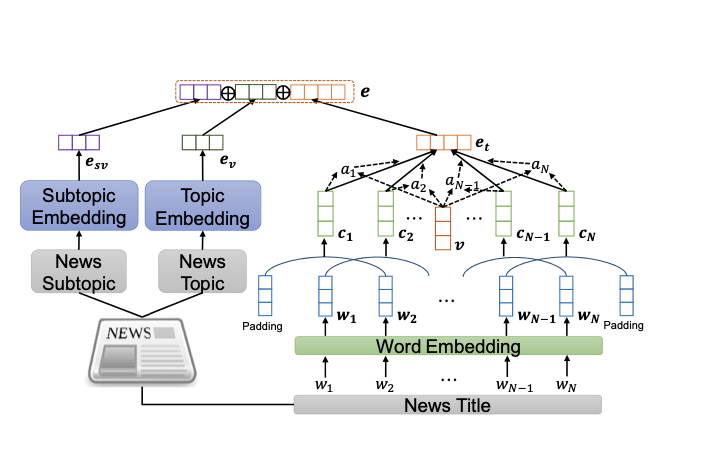
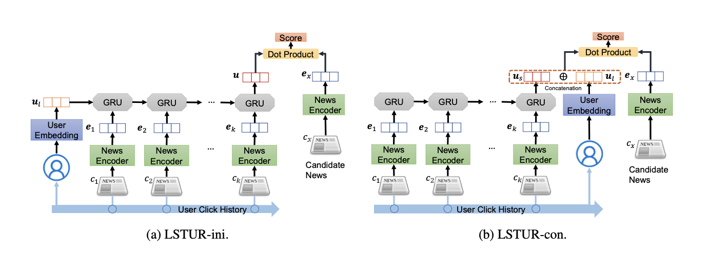

# Introduction
LSTUR is a neural news recommendation approach which can learn both long- and short-term user representations. The core of this model is a news encoder and a user encoder. In the news encoder, it can learn representations of news from their titles and topic categories, and use an attention network to highlight important words for informative representation learning. In the user encoder, it can learn learn long-term representations of users from the embeddings of their IDs.

LSTUR consists of two parts: news encoder and user encoder.

1. news encoder

There are two sub-modules in the news encoder, i.e., a title encoder and a topic encoder.The title encoder is used to learn news representations from titles.The topic encoder module is used to learn news representations from its topics and subtopics.

2. user encoder
The user encoder is used to learn representations of users from the history of their browsed news. It contains two modules, i.e., a short-term user representation model (STUR) to capture user’s temporal interests, and a long-term user representation model (LTUR) to capture user’s consistent preferences.

There are two methods to com- bine the long-term and short-term user presenta- tions for unified user representation. The first method is using the long-term user representation to initialize the hidden state of the GRU network in the short-term user representation model. The second method is concatenating the long-term user representation with the short-term user represen- tation as the final user representation.

# Dataset
Mind dataset is the additional dataset besides Cornac built-in dataset. It's the original dataset used in the paper. Microsoft News Dataset (MIND) is a large-scale dataset for news recommendation research. It was collected from anonymized behavior logs of Microsoft News website. MIND contains about 160k English news articles and more than 15 million impression logs generated by 1 million users. Every news article contains rich textual content including title, abstract, body, category and entities. Each impression log contains the click events, non-clicked events and historical news click behaviors of this user before this impression.

# Experiment
Here's the example code to use lstur algorithm:

	# prepare user-item pair for your dataset
	# mind_data 

	# Instantiate an evaluation method to split data into train and test sets.
	ratio_split = RatioSplit(
    	data=mind_data,
    	test_size=0.2,
    	exclude_unknowns=True,
    	verbose=True,
    	seed=123,
    	rating_threshold=0.5,
	)
	# Instantiate the LSTUR model
	lstur = cornac.models.LSTUR(
   		n_epochs = 5,
                batch_size = 32
	)

	metrics = [MAE(), RMSE(), MSE(),FMeasure(k=300),Precision(k=300),
           	Recall(k=300), NDCG(k=300), NCRR(k=300),
           	MRR(),AUC(), MAP()]

	# Put everything together into an experiment and run it
	cornac.Experiment(
    	eval_method=ratio_split,
    	models=[lstur],
    	metrics=metrics,
    	user_based=True,
	).run()

