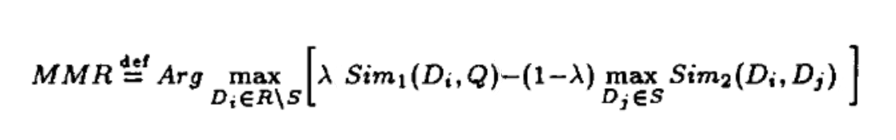

### Goal
We have discussed 2 methods in the last two pages about re-ranking items. The goal of this page is to integrate re-ranking algorithm into Cornac.

### Method
Maximal Marginal Relevance (a.k.a. MMR) algorithm [1] aims to reduce the redundancy of ranking results while ensuring the accuracy. It was first used in the fields of text abstract extraction and information retrieval. In the recommendation scenario, while recommending related products to users, in the meantime, ensuring the diversity of recommendation results, that is, there is a trade-off between relevance and diversity in ranking results.

Refering to the MMR (Maximal Marginal Relevance) forumla:

Where $C$ is a document collection (or document stream); $Q$ is a query or user profile; $R = IR(C, Q, θ)$, i.e., the ranked list of documents retrieved by an IR system, given $C$ and $Q$ and a relevance threshold $θ$, below which it will not retrieve documents ($θ$ can be degree of match or number of documents); $S$ is the subset of documents in $R$ already selected; R\S is the set difference, i.e, the set of as yet unselected documents in $R$.

$Sim1$ stands for the predicted scores of the recommendation algorithms, while $sim2$ is the objective diversity metric which is what the users want to improve. For example, if the user wants to improve [Calibration](Calibration), then the $sim2$ is replaced by the Calibration and metric results. $λ$ is a factor to adjust the re-ranking results. **We suggest improving one metric each time, otherwise the sum of diversity metrics will be computed.**

### Experiment
#### Setup
We apply [Collaborative Topic Regression (CTR)](https://github.com/PreferredAI/cornac/tree/master/cornac/models/ctr) algorithm, using _MIND_ dataset to test the re-ranking algorithm. **k** means the number of candidate list, **rerank** means the number of re-ranking items from the candidates, **lambda_constant** is the adjustable factor which is between 0 and 1, **diversity_objective** is a list (<i>suggest including one metric each time</i>) including the metric that will be improved, and the **reranking_metrics** list include metrics that will be re-computed after re-ranking.

	# import dataset feedback
	feedback = mind.load_feedback(fpath="./data_mind_dummy/mind_uir.csv")
	# define diversity metric
	sentiment = mind.load_sentiment(fpath="./tests/enriched_data/sentiment.json")
	category = mind.load_category(fpath="./tests/enriched_data/category.json")
	complexity = mind.load_complexity(fpath="./tests/enriched_data/complexity.json")
	story = mind.load_story(fpath="./tests/enriched_data/story.json")
	genre = mind.load_category_multi(fpath="./tests/enriched_data/category.json")
	entities = mind.load_entities(fpath="./tests/enriched_data/party.json")
	min_maj = mind.load_min_maj(fpath="./tests/enriched_data/min_maj.json")

	rs = RatioSplit(
            data=feedback,
            test_size=0.2,
            exclude_unknowns=True,
            verbose=True,
            seed=123,
            rating_threshold=0.5,
        )

	Item_sentiment = mind.build(data=sentiment, id_map=mind_ratio_split.train_set.iid_map)
	Item_category = mind.build(data=category, id_map=mind_ratio_split.train_set.iid_map)
	Item_complexity = mind.build(data=complexity, id_map=mind_ratio_split.train_set.iid_map)
	Item_stories = mind.build(data=story, id_map=mind_ratio_split.train_set.iid_map)
	Item_entities = mind.build(data=entities, id_map=mind_ratio_split.train_set.iid_map)
	Item_min_major = mind.build(data=min_maj, id_map=mind_ratio_split.train_set.iid_map)
	Item_genre = mind.build(data=genre, id_map=mind_ratio_split.train_set.iid_map)
	Item_feature = Item_genre

	act_10 = Activation(item_sentiment= Item_sentiment, divergence_type='JS', k=10)
	cal_10 = Calibration(item_feature = Item_category, data_type="category",divergence_type='JS', k=10)
	cal_complexity_10 = Calibration(item_feature = Item_complexity, data_type="complexity", 	divergence_type='JS', k=10)
	frag_10 = Fragmentation(item_story = Item_stories,n_samples = 1,  divergence_type='JS', k=10)
	ndcg_10 = NDCG_score(k=10)
	gini_10 = GiniCoeff(item_genre = Item_genre,k=10)
	alterVoice_10 = AlternativeVoices(item_minor_major=Item_min_major, divergence_type='JS',k=10)
	eild_10 = EILD(item_feature=Item_feature, k=10)
	rep_10 = Representation(item_entities=Item_entities, divergence_type='JS', k=10)
	ild_10 = ILD(item_feature=Item_feature, k=10)

	# define accuracy metric
	recall_10 = Recall(k=10)
	precision_10 = Precision(k=10)
	ndcg_rank_10 = NDCG(k=10)
	ncrr_10 = NCRR(k=10)
	f1_10 = FMeasure(k=10)

	metrics = [f1_10,recall_10,precision_10,ndcg_rank_10,ncrr_10,          act_10,cal_10,cal_complexity_10,frag_10,ndcg_10,gini_10,eild_10,rep_10,ild_10,alterVoice_10]
	
	reranking_metrics = [f1_10,recall_10,precision_10,ndcg_rank_10,ncrr_10, act_10,cal_10,cal_complexity_10,frag_10,ndcg_10,gini_10,eild_10,rep_10,ild_10,alterVoice_10]

	# define model
	ctr = cornac.models.CTR(
        k=400,
        lambda_u=0.01,
        lambda_v=0.01,
        eta=0.01,
        a=1,
        b=0.01,
        max_iter=50,
        trainable=True,
        verbose=True,
        seed=123,
    )

	# run experiment
	cornac.Experiment(
            eval_method=rs,
            models= [ctr],
            metrics=metrics,
            k=100,  # the number of candidate set
            rerank=10,  # the number of re-ranking items
            lambda_constant=0,  # 0~1
            diversity_objective=[Calibration(item_feature=Item_category,data_type="category",divergence_type='JS')],
            reranking_metrics=reranking_metrics
            verbose=True,
        ).run()

### Results

Diveristy_objective: 'Calibration Category' metric, which means the diversity metric that will be improved.

TEST:

|...|   F1@10 | NCRR@10 | NDCG@10 | Precision@10 | Recall@10 | Activation@10 | AltVoices_mainstream@10 | Calibration_category@10 | Calibration_complexity@10 | EILD@10 | Fragmentation@10 | GiniCoeff@10 | ILD@10 | NDCG_score@10 | Representation@10 | Train (s) | Test (s) |
|:----:|:----:|:----:|:----:|:----:|:----:|:----:|:----:|:----:|:----:|:----:|:----:|:----:|:----:|:----:|:----:|:----:|:----:|
| CTR | 0.0073 |  0.0130 |  0.0141 |       0.0048 |    0.0159 |  0.2768 |  0.0813 |                  0.3436 | 0.1959 |  0.8165 | 0.8451 |  0.8024 |0.8196 |     0.0300 |       0.5774 |    8.7260 |   5.9333

**lambda_constant = 0.0**

RE-RANKING:

|...|   F1@10 | NCRR@10 | NDCG@10 | Precision@10 | Recall@10 | Activation@10 | AltVoices_mainstream@10 | Calibration_category@10 | Calibration_complexity@10 | EILD@10 | Fragmentation@10 | GiniCoeff@10 | ILD@10 | NDCG_score@10 | Representation@10 | Re-rank Time (s)|
|:----:|:----:|:----:|:----:|:----:|:----:|:----:|:----:|:----:|:----:|:----:|:----:|:----:|:----:|:----:|:----:|:----:|
| CTR |  0.0000 |  0.0000 |  0.0000 |       0.0000 |    0.0000 |        0.3080 |                  0.1063 |                  0.8965 |                    0.3846 |  0.8074 |           0.8661 |       0.8290 | 0.8117 |        0.0000 |            0.5922 |           3.2521|

**lambda_constant = 0.5**

RE-RANKING:

|...|   F1@10 | NCRR@10 | NDCG@10 | Precision@10 | Recall@10 | Activation@10 | AltVoices_mainstream@10 | Calibration_category@10 | Calibration_complexity@10 | EILD@10 | Fragmentation@10 | GiniCoeff@10 | ILD@10 | NDCG_score@10 | Representation@10 | Re-rank Time (s)|
|:----:|:----:|:----:|:----:|:----:|:----:|:----:|:----:|:----:|:----:|:----:|:----:|:----:|:----:|:----:|:----:|:----:|
| CTR | 0.0073 |  0.0130 |  0.0141 |       0.0048 |    0.0159 |        0.2564 |                  0.1074 |                  0.6734 |                    0.3379 |  0.8407 |           0.8658 |       0.7733 | 0.8535 |        0.0300 |            0.5893 |           2.6514|

**lambda_constant = 0.8**

RE-RANKING:

|...|   F1@10 | NCRR@10 | NDCG@10 | Precision@10 | Recall@10 | Activation@10 | AltVoices_mainstream@10 | Calibration_category@10 | Calibration_complexity@10 | EILD@10 | Fragmentation@10 | GiniCoeff@10 | ILD@10 | NDCG_score@10 | Representation@10 | Re-rank Time (s)|
|:----:|:----:|:----:|:----:|:----:|:----:|:----:|:----:|:----:|:----:|:----:|:----:|:----:|:----:|:----:|:----:|:----:|
| CTR | 0.0000 |  0.0000 |  0.0000 |       0.0000 |    0.0000 |        0.2762 |                  0.0663 |                  0.2566 |                    0.1925 |  0.8983 |           0.8450 |       0.7124 | 0.8981 |        0.0000 |            0.5763 |           3.2078|

**lambda_constant = 1.0**

RE-RANKING:

|...|   F1@10 | NCRR@10 | NDCG@10 | Precision@10 | Recall@10 | Activation@10 | AltVoices_mainstream@10 | Calibration_category@10 | Calibration_complexity@10 | EILD@10 | Fragmentation@10 | GiniCoeff@10 | ILD@10 | NDCG_score@10 | Representation@10 | Re-rank Time (s)|
|:----:|:----:|:----:|:----:|:----:|:----:|:----:|:----:|:----:|:----:|:----:|:----:|:----:|:----:|:----:|:----:|:----:|
|CTR | 0.0073 |  0.0130 |  0.0141 |       0.0048 |    0.0159 |        0.2768 |                  0.0819 |                  0.3578 |                    0.2138 |  0.8138 |           0.8372 |       0.8038 | 0.8156 |        0.0300 |            0.5612 |           2.8859|

### Conclusion
From above experiment, we can conclude that we can change metrics results through adjusting lambda_constant factor. When lambda_constant is near 0, the accuracy metric results decease, while the objective diversity metric ('calibration category') inceases obviously (from 0.3436 to 0.8965), and other diversity metric results are also influenced; when lambda_constant is near 1, the metric results are near results before re-ranking. In summary, when lambda_constant is near 1, the results are near the standard relevance-ranked list, while lambda_constant is near 0, the objective diversity is improved more.

### Reference
[1] Carbonell, J. and Goldstein, J. (2017) ‘The use of MMR, diversity-based reranking for reordering documents and producing summaries’, ACM SIGIR Forum, 51(2), pp. 209–210. doi:10.1145/3130348.3130369. 