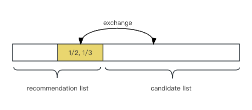
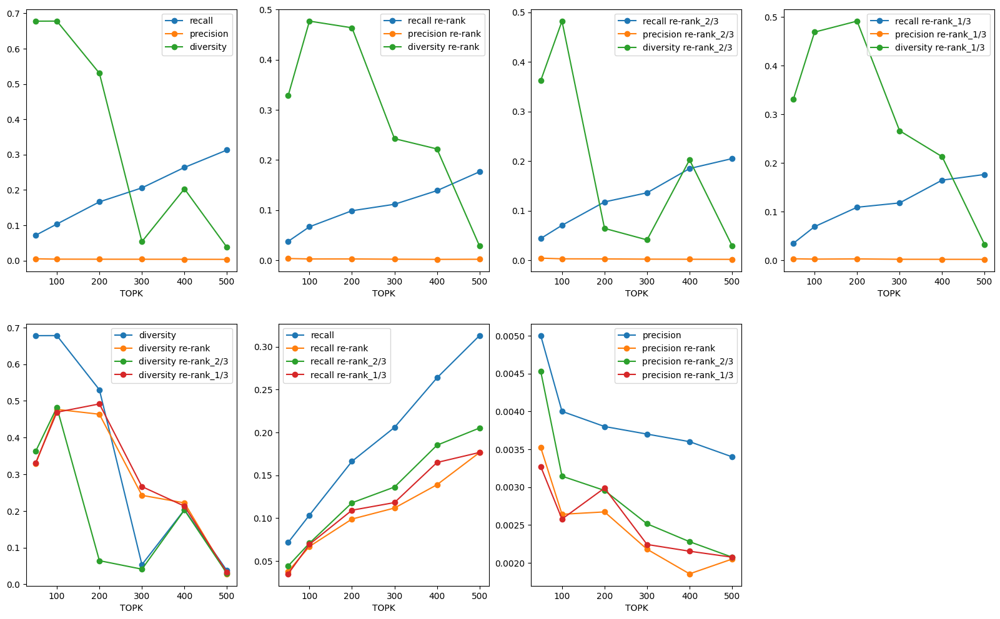

### Introduction and goal of experiments
Recommender systems typically try to predict the ratings of unknown items for each user, often using other users’ ratings, and recommend top N items with the highest predicted ratings. In recent years, the diversity of recommenders has become a hotspot. There appears a variety of researches studying how to improve the diversity of recommendation systems through improving algorithms. However, instead of proposing new algorithms or changing existing ones, other approaches are possible. For example, some studies show that it is possible to obtain higher diversity simply by recommending less popular items; however, the loss of recommendation accuracy in this case can be substantial. One other alternative is to re-rank the list of possible recommended items such that diversity is maximised. So in this section, we study the influence of re-ranking on the diversity and accuracy of the CTR algorithm.

### Experiment
#### Setup
* Model: [Collaborative Topic Regression](https://gitlab.ifi.uzh.ch/ddis/Students/Projects/2023-diversity-framework/-/wikis/Collaborative-Topic-Regression-(ctr-algorithm))
* Dataset: MIND
* Parameter: @TOPK (k): 50~500
* Metric: Recall, Precision, diversity
* Others: Default

We re-rank recommendation list from the result of CTR model, calculate recall and [diversity from RADio's metrics[2]](https://gitlab.ifi.uzh.ch/ddis/Students/Projects/2023-diversity-framework/-/blob/algorithm/cornac/algorithm/select-top-5/diversity_mind.py)
, and compare the changes on recall, precision and diversity.

	# Instantiate CTR model
	ctr_50 = cornac.models.CTR(k=50, max_iter=50, lambda_v=1)
	# Use Recall@50, Precision@50 for evaluation
	rec_50 = cornac.metrics.Recall(k=50)
	precision_50 = cornac.metrics.Precision(k=50)

	# Put everything together into an experiment and run it
	cornac.Experiment(eval_method=mind_ratio_split, models=[ctr_50], metrics=[rec_50, precision_50]).run()

#### Process
First, we exchange the last second part of the recommendation list (k) with the rest candidates. As the diversity seems to decrease, then we split into 1/3, 2/3 (exchange 1/3 or 2/3 part in the recommendation list with the candidates in the rest of the list) (as **Figure 1** below shows), and compare the changes refering to Adomavicius's paper[1]. We can observe the results from below picture (**Figure  2**). In the four figures of the first row, the x axis is the variable @TOPK, we adujust it from 50 to 500, the y axis means different metric results. In the second row, the three figures respectively represents the change of diversity, recall, and precision with @TOPK and re-rank strategies as we introduce above.

{:height="600px" width="400px"}

{:height="600px" width="800px"}

### Conclusion
We can conclulde that with recommendation numbers increasing, recall increases, but diversity decreases. From the last three figures, we can see when @TOPK is less than 200, the original recommendations' diversity is the largerst; when @TOPK is continually increasing, re-ranking part of the resommendation list (1/2 or 1/3) may perform better in diversity, but yet recall and precision decrease. 

Re-ranking is the easiest way to influence the diversity of the recommendation list without changing the algorithm itself. We have proven that re-ranking has some effect on diversity and accuracy of recommendation lists. Next, we try to (select the top k items)[Select-Top-5-Diversed-Items] from a set of candidates that are the most diverse. 

### Reference
[1] Adomavicius, G. and YoungOk Kwon (2012) ‘Improving aggregate recommendation diversity using ranking-based techniques’, IEEE Transactions on Knowledge and Data Engineering, 24(5), pp. 896–911. doi:10.1109/tkde.2011.15. 

[2] Vrijenhoek, S., Bénédict, G., Gutierrez Granada, M., Odijk, D., & De Rijke, M. (2022, September). RADio–Rank-Aware Divergence Metrics to Measure Normative Diversity in News Recommendations. In Proceedings of the 16th ACM Conference on Recommender Systems (pp. 208-219).