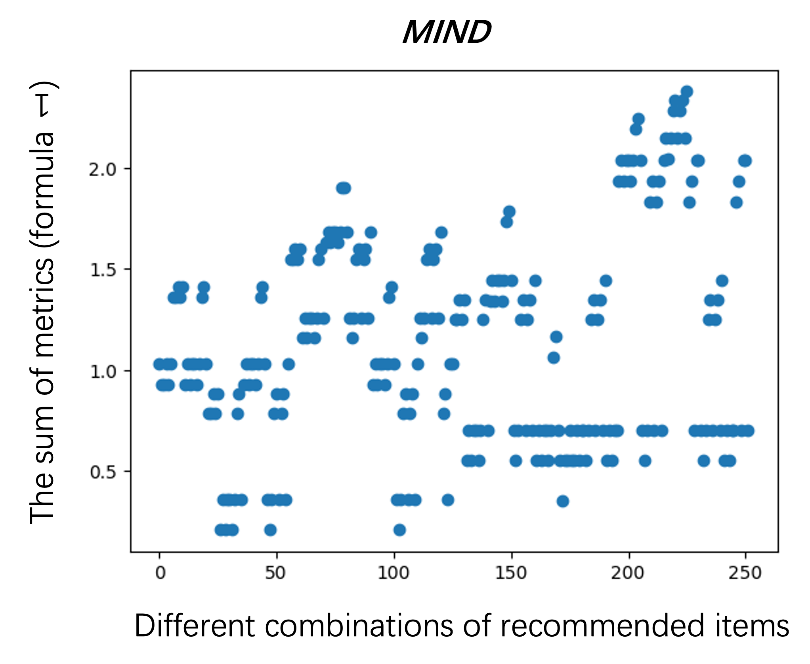
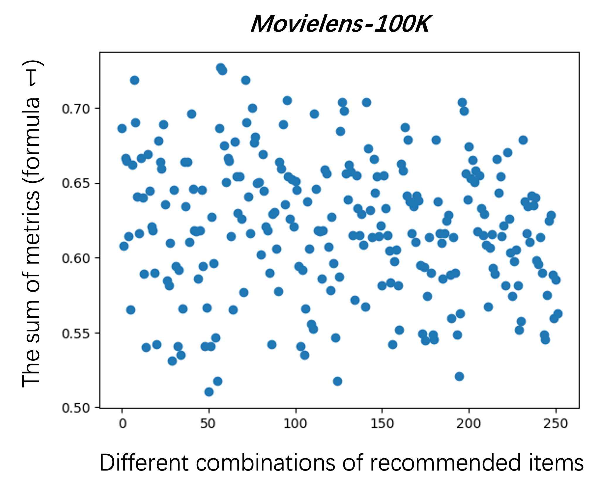
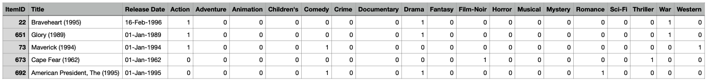
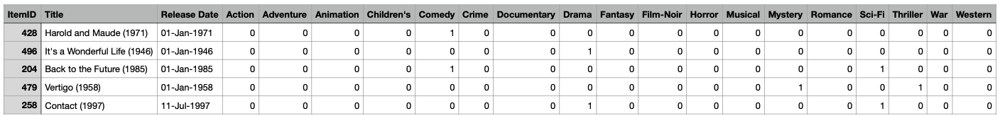
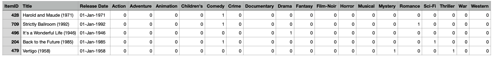

### Goal
As people often notice the first dozens of recommendions in the list, in this section, we want to select the top diversed items from the recommendation list. The algorithms built in cornac mainly aim for accuracy. However, it often happens that products in the recommendation list are highly similar to each other and lack diversity. While the loss of accuarcy cannot be avoided if we improve the diversity, the trade-off between diversity and matching quality can be researched and optimized. So here, we want to select the top 5 items in the recommendation list with higher diversity, and also reduced loss of accuracy. 

### Method
We first train [CTR algorithm](https://gitlab.ifi.uzh.ch/ddis/Students/Projects/2023-diversity-framework/-/wikis/Collaborative-Topic-Regression-(ctr-algorithm)) with _MIND_ and _Movielens_ data as our other experiments show. At the beginning, we use recursion to get the highest diversity through exchanging last two items' positions in each loop, but the result is almost the same as the original list, not only not improve the diversity, but also the efficiency is much low. So we start from the definition.

The diversity in the recommendation list include two meanings:
* diversity between recommendations and users' historical lists (_individual diversity_)
* diversity among the recommendation list (_aggregate diversity_)

However, high individual diversity of recommendations does not necessarily imply high aggregate diversity. For example, if the system recommends to all users the same five best selling items that are not similar to each other, the recommendation list for each user is diverse (i.e., high individual diversity), but only five distinct items are recommended to all users and purchased by them (i.e., resulting in low aggregate diversity or high sales concentration). So in order to consider both of them, we construct two formulas, one includes both kinds of diversities; another one also includes recall.

1. $0.5 \times calibrationMetric + 0.5 \times intraDistance$
2. $0.25 \times calibrationMetric + 0.25 \times intraDistance + 0.5 \times recall$

### [Experiment](https://gitlab.ifi.uzh.ch/ddis/Students/Projects/2023-diversity-framework/-/tree/algorithm/cornac/algorithm/select-top-5)
#### Setup
We want to find the combination that makes the highest value in above formula. We train CTR model with its optimized parameters, and split data into train (80%) and test (20%) data (We have shown in other [ CTR experiments](https://gitlab.ifi.uzh.ch/ddis/Students/Projects/2023-diversity-framework/-/wikis/Collaborative-Topic-Regression-(ctr-algorithm))). We calculate the accuracy metric _Recall_ and diversity metric [calibration](Calibration) and [Intra-list diversity](https://gitlab.ifi.uzh.ch/ddis/Students/Projects/2023-diversity-framework/-/wikis/Intra-list-diversity), observe the result listed items. For the datasets, we encode the items according to their categories using one-hot encodings:
	
##### MIND
	{'video': array([1., 0., 0., 0., 0., 0., 0., 0., 0., 0., 0., 0., 0., 0.]),
 	'autos': array([0., 1., 0., 0., 0., 0., 0., 0., 0., 0., 0., 0., 0., 0.]),
 	'health': array([0., 0., 1., 0., 0., 0., 0., 0., 0., 0., 0., 0., 0., 0.]),
 	'foodanddrink': array([0., 0., 0., 1., 0., 0., 0., 0., 0., 0., 0., 0., 0., 0.]),
 	'music': array([0., 0., 0., 0., 1., 0., 0., 0., 0., 0., 0., 0., 0., 0.]),
 	'movies': array([0., 0., 0., 0., 0., 1., 0., 0., 0., 0., 0., 0., 0., 0.]),
 	'tv': array([0., 0., 0., 0., 0., 0., 1., 0., 0., 0., 0., 0., 0., 0.]),
 	'sports': array([0., 0., 0., 0., 0., 0., 0., 1., 0., 0., 0., 0., 0., 0.]),
 	'travel': array([0., 0., 0., 0., 0., 0., 0., 0., 1., 0., 0., 0., 0., 0.]),
 	'weather': array([0., 0., 0., 0., 0., 0., 0., 0., 0., 1., 0., 0., 0., 0.]),
 	'finance': array([0., 0., 0., 0., 0., 0., 0., 0., 0., 0., 1., 0., 0., 0.]),
 	'news': array([0., 0., 0., 0., 0., 0., 0., 0., 0., 0., 0., 1., 0., 0.]),
 	'lifestyle': array([0., 0., 0., 0., 0., 0., 0., 0., 0., 0., 0., 0., 1., 0.]),
 	'entertainment': array([0., 0., 0., 0., 0., 0., 0., 0., 0., 0., 0., 0., 0., 1.])}

##### Movielens
| ItemID | Title | Release Date | Action | Adventure | Animation | Children's | Comedy | Crime | Documentary | Drama | Fantasy | Film-Noir | Horror | Musical |
|:----:|:----:|:----:|:----:|:----:|:----:|:----:|:----:|:----:|:----:|:----:|:----:|:----:|:----:|:----:|
| 1309 | Very Natural Thing, A (1974) | 01-Jan-1974 | 0 | 0 | 0 | 0 | 0 | 0 | 0 | 1 | 0 | 0 | 0 | 0 | 
| 814 | Great Day in Harlem, A (1994) | 01-Jan-1994 | 0 | 0 | 0 | 0 | 0 | 0 | 1 | 0 | 0 | 0 | 0 | 0 | 

### Results
##### MIND
For the mind dataset, the recall is 0.2482 in the top 300 recommended items. We get different combinations of 5 items using combinations. Then we calculate the results based on the formulas (as **Figure 1** shows), and get the combination when the value is the highest. Take the result from user0 as an example, from below Figure, the x axis is the the ordinal number of different combinations of groups, and the y axis is the result calculating from 1st formula descbribed above. We can see that between 200 and 250, the value is the highest. So we extract the categories from this combination list.

{:height="300px" width="300px"}

 
* The combination is **['lifestyle', 'tv', 'travel', 'news', 'autos']**
* The user history is **['finance', 'news', 'finance', 'news', 'health']**
* The recall decreases to 0.1422. 

We can observe from the result, the newly selected 5 items are different from each other (individual diversity) and distinguished from user historical list (aggregate diversity), so the diversity is greatly improved and reserve user0's preferences in the meantime.

##### Movielens
We also experiment on movielens dataset (as **Figure 2** shows). The y axis is also the result calculating from 1st formula. we calculate recall and diversity before and after reranking. The recall decreases from 0.7163 to 0.3844.

{:height="300px" width="300px"}

* The top 5 items from user's history are as follow: **['Braveheart (1995)', 'Glory (1989)', 'Maverick (1994)', 'Cape Fear (1962)', 'American President, The (1995)']**

* The top 5 items in the new combinations after selecting are: **['Harold and Maude (1971)', 'It's a Wonderful Life (1946)', 'Back to the Future (1985)', 'Vertigo (1958)', 'Contact (1997)']**

* The top 5 items in the original recommendations are: **['Harold and Maude (1971)', 'Strictly Ballroom (1992)', 'It's a Wonderful Life (1946)', 'Back to the Future (1985)', 'Vertigo (1958)']**

We can observe from the result: the original recommendations are mostly Comedy, and user's history includes Comedy and Drama, which means the accuracy is good, but lacks diversity. However, the newly selected 5 items include Mystery, Sci-Fi movies that the history does not include, so this will bring users new kinds of movies. In summary, the original recommendations are homogeneous, but the new recommendations are more diverse.

### Conclusion
We first define the meanings of diversity (individual and aggregate diversity), then we construct the formulas, and find the optimal combination of items from the recommendation list. At the end, we indeed improve both diversities and get 5 items which are most diversed.

Then, we will discuss what is the best method to re-rank that is to be integrated into Cornac (Re-ranking)[Re-rank-TOP-K-from-a-set-of-Candidates].

### Reference
Adomavicius, G. and YoungOk Kwon (2012) ‘Improving aggregate recommendation diversity using ranking-based techniques’, IEEE Transactions on Knowledge and Data Engineering, 24(5), pp. 896–911. doi:10.1109/tkde.2011.15. 